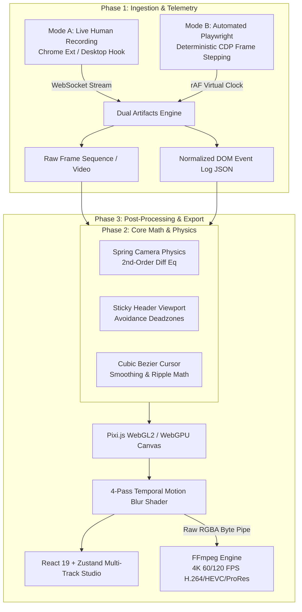

# FocalDOM 🎯🎥

<div align="center">

[](LICENSE)
[](https://nodejs.org/)
[](https://pnpm.io/)
[](https://www.typescriptlang.org/)
[](https://playwright.dev/)
[](https://pixijs.com/)
[](https://react.dev/)
[](https://www.electronjs.org/)
[](https://ffmpeg.org/)
[](https://vitest.dev/)

**DOM-Aware Intelligent Video Recording & Dynamic Virtual Camera Studio**

*Bridges deterministic browser automation and post-processing virtual camera rendering to create studio-grade web product demos.*

[Explore Architecture](docs/Technical%20Architecture%20&%20Engineering%20Plan.md) • [Implementation Roadmap](TODO/README.md) • [Report Issue](https://github.com/dhaatrik/focal-dom/issues)

</div>

---

## 📖 Table of Contents

- [Executive Overview](#-executive-overview)
  - [The Problem](#the-problem)
  - [The FocalDOM Solution](#the-focaldom-solution)
- [System Architecture](#-system-architecture)
- [Key Features](#-key-features)
- [Tech Stack](#-tech-stack)
- [Repository & Package Layout](#-repository--package-layout)
- [Getting Started](#-getting-started)
  - [Prerequisites](#prerequisites)
  - [Installation](#installation)
- [Usage & Examples](#-usage--examples)
  - [Mode B: Playwright Automated Capture (CLI)](#mode-b-playwright-automated-capture-cli)
  - [Mode B: TypeScript SDK](#mode-b-typescript-sdk)
  - [Mode A: Live Chrome Extension Recording](#mode-a-live-chrome-extension-recording)
  - [Studio & Exporting](#studio--exporting)
- [Testing & Quality Assurance](#-testing--quality-assurance)
- [Contributing](#-contributing)
- [License & Author](#-license--author)
- [Connect & Community](#-connect--community)

---

## 💡 Executive Overview

### The Problem
Traditional screen recording tools are **DOM-blind pixel recorders**. When capturing web applications for product walkthroughs, teasers, or developer documentation:
- Automated zooming requires painful manual keyframing.
- Virtual cameras arbitrarily crop or obscure sticky headers and floating navigation bars.
- Mouse recordings suffer from jerky sub-pixel jitter, missed hover states, and abrupt cuts.
- Exporting multi-layer 4K 60/120 FPS videos on desktop machines quickly runs into CPU/memory bottlenecks.

### The FocalDOM Solution
**FocalDOM** bridges deterministic browser automation (Playwright/CDP) and live browser telemetry with a hardware-accelerated post-processing virtual camera engine.

By pairing frame-accurate 60/120 FPS video capture with **in-page semantic DOM metadata extraction**, FocalDOM automatically computes spring-physics camera transitions, applies intelligent sticky-header avoidance safe-zones, reconstructs continuous cubic Bezier vector cursors, and streams uncompressed raw RGBA frames directly into FFmpeg for 4K video generation.

---

## 🏗️ System Architecture



---

## ✨ Key Features

- **🎯 Semantic Auto-Framing:** Auto-focuses on target elements (buttons, inputs, cards) with natural spring-physics ease-in/ease-out curves and an anticipatory 400ms look-ahead buffer.
- **🛡️ Sticky & Fixed Element Safe-Zones:** Analyzes `position: fixed` and `position: sticky` headers in real time, locking viewport deadzones to prevent critical navigation elements from being cropped.
- **🖱️ Vector Cursor Smoothing:** Reconstructs mouse coordinates into continuous $C^1$-smooth cubic Bezier spline trajectories with animated click ripple pulses and state-aware cursor shapes.
- **⚡ Hardware-Accelerated Motion Blur:** 4-sample sub-frame accumulation rendering via Pixi.js (WebGL2/WebGPU) delivering silky-smooth motion streaks.
- **🎬 NLE Multi-Track Timeline Studio:** React 19 + Zustand timeline editor featuring draggable keyframe blocks, DOM event inspectors, and real-time physics tuning sliders.
- **🚀 High-Throughput 4K Pipeline:** Streams uncompressed raw RGBA byte buffers directly to FFmpeg `stdin` (`-f rawvideo -pix_fmt rgba`) avoiding CPU-heavy PNG encoding overhead.

---

## 💻 Tech Stack

| Layer | Technology | Rationale & Justification |
| :--- | :--- | :--- |
| **Monorepo & Tooling** | **PNPM Workspaces, TypeScript 5.7+** | High-speed dependency sharing, strict type safety, and fast composite builds. |
| **Core Physics & Schemas** | **`@focaldom/core` (Vanilla TS)** | Zero-dependency mathematical engine for spring equations, Bezier smoothing, and event schemas. |
| **Automation Engine** | **Playwright + CDP** | Frame-by-frame deterministic virtual clock advancement (`window.__focal_tick()`) with zero dropped frames. |
| **Canvas & Shaders** | **Pixi.js (WebGL2 / WebGPU)** | Hardware-accelerated 2D transforms, layer compositing, and multi-pass temporal motion blur. |
| **NLE Timeline UI** | **React 19, Zustand, TailwindCSS** | High-performance reactive state management and modern multi-track timeline editing. |
| **Desktop Shell** | **Electron (Windows)** | Native OS file access, bundled static FFmpeg binaries, and low-latency IPC. |
| **Video Encoding** | **FFmpeg (Raw RGBA Pipe)** | Direct uncompressed frame streaming to H.264/HEVC/ProRes at $\ge 60\text{ FPS}$ compilation speed. |
| **Test Framework** | **Vitest** | Workspace-wide lightning-fast unit and integration testing. |

---

## 📂 Repository & Package Layout

```
focal-dom/
├── docs/                            # Formal architecture and technical specifications
│   └── Technical Architecture & Engineering Plan.md
├── TODO/                            # Modular phase-by-phase implementation blueprints
│   ├── README.md                    # Roadmap index & dependency graph
│   ├── Implement_00_Foundation_Monorepo.md
│   ├── Implement_01_Core_Engine.md
│   ├── Implement_02_Capture_Playwright.md
│   ├── Implement_03_Renderer_Engine.md
│   ├── Implement_04_Studio_Timeline.md
│   ├── Implement_05_Desktop_App.md
│   └── Implement_06_Chrome_Extension.md
├── packages/
│   ├── core/                        # @focaldom/core: SpringCamera, Bezier math, DOM schemas
│   ├── capture-playwright/          # @focaldom/capture-playwright: Mode B runner & CLI
│   ├── renderer/                    # @focaldom/renderer: Pixi.js WebGPU engine & FFmpeg streamer
│   ├── studio/                      # @focaldom/studio: React NLE timeline editor
│   └── extension/                   # @focaldom/extension: Manifest V3 Chrome Extension
└── apps/
    └── desktop/                     # @focaldom/desktop: Electron Windows shell
```

---

## 🚀 Getting Started

### Prerequisites

- **Node.js**: `v22.0.0` or higher
- **PNPM**: `v11.0.0` or higher (`npm install -g pnpm`)
- **Git**: `v2.40.0` or higher
- **FFmpeg**: (Optional for CLI if not using bundled Electron runtime; required in PATH for standalone CLI rendering)

### Installation

1. **Clone the repository:**
   ```bash
   git clone https://github.com/dhaatrik/focal-dom.git
   cd focal-dom
   ```

2. **Install workspace dependencies:**
   ```bash
   pnpm install
   ```

3. **Verify typecheck and build packages:**
   ```bash
   pnpm typecheck
   pnpm build
   ```

4. **Run test suites:**
   ```bash
   pnpm test
   ```

---

## 🕹️ Usage & Examples

### Mode B: Playwright Automated Capture (CLI)

Define a declarative user recording scenario in YAML (`scenario.yaml`):

```yaml
name: "Product Tour Demo"
targetUrl: "https://example.com"
viewport:
  width: 1920
  height: 1080
fps: 60
steps:
  - goto: "https://example.com"
  - wait: 500
  - hover: "#features-menu"
  - wait: 300
  - click: "#cta-button"
  - type:
      selector: "#search-input"
      text: "FocalDOM virtual camera"
      delay: 40
  - wait: 1000
```

Execute the recording via the CLI:
```bash
pnpm --filter @focaldom/capture-playwright focaldom capture scenario.yaml --output ./recordings/demo
```

### Mode B: TypeScript SDK

Integrate directly into programmatic Playwright test suites:

```typescript
import { launchFocalSession } from '@focaldom/capture-playwright';

const session = await launchFocalSession({
  fps: 60,
  viewport: { width: 1920, height: 1080 },
  headless: true
});

const page = session.getPage();
await page.goto('https://example.com');
await page.focalClick('#signup-btn');
await page.focalType('#email', 'hello@example.com');

// Finalizes frame cache and generates events.json
await session.finalize('./recordings/signup');
```

### Mode A: Live Chrome Extension Recording

1. Navigate to `chrome://extensions/` in Chromium/Chrome.
2. Enable **Developer mode** (top right).
3. Click **Load unpacked** and select `packages/extension/dist`.
4. Open the FocalDOM Desktop App (`pnpm --filter @focaldom/desktop dev`).
5. Click **Start Recording** in the extension popup to stream live DOM coordinates and click telemetry over WebSocket (`ws://127.0.0.1:48480`).

### Studio & Exporting

Launch the Studio timeline editor:
```bash
pnpm --filter @focaldom/studio dev
```
Adjust keyframe scales, tune spring stiffness/damping in real-time, customize window border radiuses and background gradients, and export to **4K 60 FPS MP4 / ProRes / GIF**.

---

## 🧪 Testing & Quality Assurance

FocalDOM maintains strict test coverage using [Vitest](https://vitest.dev/) for math models, spring differential equations, and parser validation:

```bash
# Run all workspace unit tests
pnpm test

# Run tests in interactive watch mode
pnpm test:watch

# Run TypeScript project reference typecheck
pnpm typecheck
```

---

## 🤝 Contributing

Contributions, feature requests, and feedback are welcome! To contribute:

1. **Fork the repository** on GitHub.
2. **Create a feature branch**:
   ```bash
   git checkout -b feat/your-feature-name
   ```
3. **Commit your changes** with descriptive commit messages:
   ```bash
   git commit -m "feat(camera): add exponential decay damping mode"
   ```
4. **Push to your branch**:
   ```bash
   git push origin feat/your-feature-name
   ```
5. **Open a Pull Request** against the `main` branch.

Please ensure all tests (`pnpm test`) and typechecks (`pnpm typecheck`) pass before submitting.

---

## 📜 License & Author

Distributed under the **MIT License**. See [`LICENSE`](LICENSE) for complete details.

**Author:** Dhaatrik Chowdhury  
**Copyright:** © 2026 Dhaatrik Chowdhury

---

## 🌐 Connect & Community

Let's connect, collaborate, and build something extraordinary:

<div align="left">

- 💼 **LinkedIn:** [linkedin.com/in/dhaatrik](https://www.linkedin.com/in/dhaatrik)
- 🐦 **X / Twitter:** [@dhaatrik](https://x.com/dhaatrik)
- 🐙 **GitHub:** [@dhaatrik](https://github.com/dhaatrik)
- 🌍 **Personal Website:** [dhaatrik.github.io](https://dhaatrik.github.io/)

</div>
