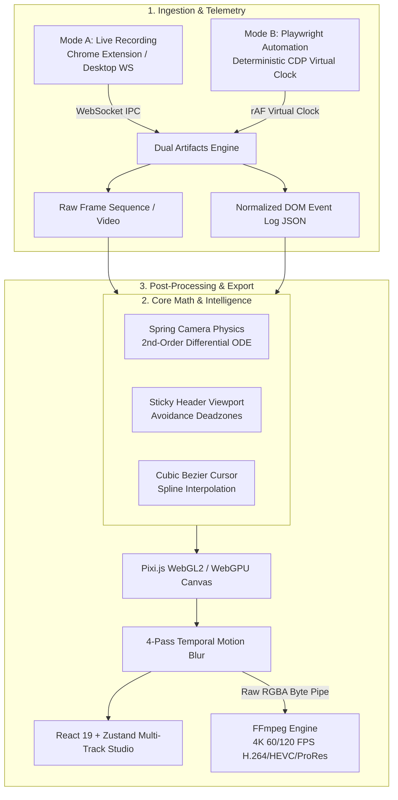

# FocalDOM

<div align="center">

[](LICENSE)
[](https://nodejs.org/)
[](https://pnpm.io/)
[](https://www.typescriptlang.org/)
[](https://playwright.dev/)
[](https://pixijs.com/)
[](https://react.dev/)
[](https://www.electronjs.org/)
[](https://ffmpeg.org/)
[](https://vitest.dev/)

**DOM-Aware Intelligent Video Recording & Dynamic Virtual Camera Studio**

*Bridges deterministic browser automation and post-processing virtual camera rendering to produce studio-grade web product demos.*

[Technical Architecture](docs/Technical%20Architecture%20&%20Engineering%20Plan.md) • [Engineering Roadmaps](TODO/README.md) • [Audit Report](TODO/AUDIT_REPORT.md) • [Report Issue](https://github.com/dhaatrik/focal-dom/issues)

</div>

---

## Table of Contents

- [Executive Overview](#executive-overview)
  - [The Problem](#the-problem)
  - [The FocalDOM Solution](#the-focaldom-solution)
- [System Architecture](#system-architecture)
- [Key Features](#key-features)
- [Technology Stack](#technology-stack)
- [Repository & Package Architecture](#repository--package-architecture)
- [Getting Started](#getting-started)
  - [Prerequisites](#prerequisites)
  - [Installation](#installation)
- [Usage & Examples](#usage--examples)
  - [Mode B: Automated Playwright Capture (CLI)](#mode-b-automated-playwright-capture-cli)
  - [Mode B: Programmatic TypeScript SDK](#mode-b-programmatic-typescript-sdk)
  - [Mode A: Live Chrome Extension Recording](#mode-a-live-chrome-extension-recording)
  - [Studio NLE & High-Throughput Exporting](#studio-nle--high-throughput-exporting)
- [Testing & Quality Assurance](#testing--quality-assurance)
- [Automated Versioning & Releases](#automated-versioning--releases)
- [Contributing](#contributing)
- [License & Author](#license--author)
- [Connect & Community](#connect--community)

---

## Executive Overview

### The Problem
Traditional screen recording tools are **DOM-blind pixel recorders**. When capturing web applications for product walkthroughs, developer tutorials, or marketing trailers:
- Automated zooming requires tedious, manual pan-and-scan keyframing.
- Fixed navigation bars and sticky headers are arbitrarily obscured, cropped, or sliced by naive camera zooms.
- Mouse recordings suffer from sub-pixel jitter, dropped hover states, and jarring cuts.
- Rendering high-fidelity, multi-layer 4K 60/120 FPS videos on local machines creates severe CPU and memory bottlenecks.

### The FocalDOM Solution
**FocalDOM** pairs frame-accurate 60/120 FPS capture with **in-page semantic DOM metadata extraction**.

By tracking real-time element geometries, computed z-indices, class lists, and scroll offsets during browser interactions, FocalDOM computes natural 2nd-order ODE spring-physics camera transitions, applies intelligent sticky-header avoidance safe-zones, reconstructs continuous $C^1$-smooth cubic Bezier vector cursors, and streams uncompressed raw RGBA frames directly into FFmpeg for rapid 4K video encoding.

---

## System Architecture



---

## Key Features

- **Semantic Auto-Framing:** Auto-focuses on interactive elements (buttons, inputs, cards) with customizable spring-physics curves and an anticipatory 400ms look-ahead buffer.
- **Sticky & Fixed Element Safe-Zones:** Real-time geometric analysis locks viewport deadzones, ensuring critical navigation bars are never cropped during camera zooms.
- **Vector Cursor Smoothing:** Reconstructs raw mouse events into continuous cubic Bezier spline trajectories with animated click ripple pulses and style-aware cursor icons.
- **Hardware-Accelerated Motion Blur:** 4-sample sub-frame accumulation rendering via Pixi.js (WebGL2/WebGPU) delivering smooth, cinema-grade motion blur.
- **NLE Multi-Track Timeline Studio:** React 19 + Zustand timeline editor featuring magnetic event snapping (10px threshold), DOM event inspectors, and interactive physics tuning sliders.
- **High-Throughput 4K Pipeline:** Streams uncompressed raw RGBA byte buffers directly to FFmpeg `stdin` (`-f rawvideo -pix_fmt rgba`), bypassing CPU-heavy PNG encoding bottlenecks.

---

## Technology Stack

| Layer | Technology | Rationale & Architectural Purpose |
| :--- | :--- | :--- |
| **Monorepo & Tooling** | **PNPM Workspaces, TypeScript 5.7+** | High-speed dependency linking, strict type safety, and composite incremental builds (`tsc -b`). |
| **Core Physics & Schemas** | **`@focaldom/core` (Vanilla TS)** | Zero-dependency mathematical engine for spring equations, Bezier smoothing, and event schemas. |
| **Automation Engine** | **Playwright + CDP** | Frame-by-frame deterministic virtual clock advancement (`window.__focal_tick()`) with zero temporal jitter. |
| **Canvas & Shaders** | **Pixi.js (WebGL2 / WebGPU)** | Hardware-accelerated 2D transforms, layer compositing, and multi-pass temporal motion blur shaders. |
| **NLE Timeline UI** | **React 19, Zustand, Vanilla CSS** | High-performance reactive state management and modern multi-track timeline editing. |
| **Desktop Shell** | **Electron (Windows)** | Native OS file access, bundled FFmpeg binaries, and low-latency WebSocket telemetry server (`48480`). |
| **Video Encoding** | **FFmpeg (Raw RGBA Pipe)** | Direct uncompressed frame streaming to H.264/HEVC/ProRes at $\ge 60\text{ FPS}$ encoding speeds. |
| **Test Framework** | **Vitest** | Workspace-wide multi-package unit and integration testing suite. |

---

## Repository & Package Architecture

```
focal-dom/
├── docs/                            # Formal architecture and technical specifications
│   └── Technical Architecture & Engineering Plan.md
├── TODO/                            # Actionable engineering improvement blueprints
│   ├── README.md                    # Roadmap hub and dependency graph
│   ├── AUDIT_REPORT.md              # Comprehensive line-by-line codebase audit (9.81/10)
│   ├── Improve_Now.md               # 6-part master perfection roadmap (9.8 -> 10.0)
│   ├── Improve_Core.md              # @focaldom/core engineering plan
│   ├── Improve_Capture_Playwright.md# @focaldom/capture-playwright engineering plan
│   ├── Improve_Renderer.md          # @focaldom/renderer engineering plan
│   ├── Improve_Studio.md            # @focaldom/studio engineering plan
│   ├── Improve_Desktop_App.md       # apps/desktop engineering plan
│   ├── Improve_Extension.md         # @focaldom/extension engineering plan
│   └── Improve_CICD.md              # CI/CD hardening and automated SemVer release plan
├── packages/
│   ├── core/                        # @focaldom/core: SpringCamera, Bezier math, schemas
│   ├── capture-playwright/          # @focaldom/capture-playwright: Mode B runner & CLI
│   ├── renderer/                    # @focaldom/renderer: Pixi.js WebGPU engine & FFmpeg streamer
│   ├── studio/                      # @focaldom/studio: React 19 NLE timeline editor
│   └── extension/                   # @focaldom/extension: Manifest V3 Chrome Extension
└── apps/
    └── desktop/                     # @focaldom/desktop: Electron Windows shell
```

---

## Getting Started

### Prerequisites

- **Node.js**: `v22.0.0` or higher
- **PNPM**: `v11.0.0` or higher (`npm install -g pnpm`)
- **Git**: `v2.40.0` or higher
- **FFmpeg**: (Optional for CLI if not using bundled Electron runtime; required in PATH for standalone CLI rendering)

### Installation

1. **Clone the repository:**
   ```bash
   git clone https://github.com/dhaatrik/focal-dom.git
   cd focal-dom
   ```

2. **Install workspace dependencies:**
   ```bash
   pnpm install
   ```

3. **Verify typecheck and build all packages:**
   ```bash
   pnpm typecheck
   pnpm build
   ```

4. **Execute workspace test suites:**
   ```bash
   pnpm test
   ```

---

## Usage & Examples

### Mode B: Automated Playwright Capture (CLI)

Define a declarative user interaction scenario in YAML (`scenario.yaml`):

```yaml
name: "Product Tour Demo"
targetUrl: "https://example.com"
viewport:
  width: 1920
  height: 1080
fps: 60
steps:
  - goto: "https://example.com"
  - wait: 500
  - hover: "#features-menu"
  - wait: 300
  - click: "#cta-button"
  - type:
      selector: "#search-input"
      text: "FocalDOM virtual camera"
      delay: 40
  - wait: 1000
```

Execute the recording via the CLI:
```bash
pnpm --filter @focaldom/capture-playwright focaldom capture scenario.yaml --output ./recordings/demo
```

### Mode B: Programmatic TypeScript SDK

Integrate directly into programmatic Playwright test suites:

```typescript
import { launchFocalSession } from '@focaldom/capture-playwright';

const session = await launchFocalSession({
  fps: 60,
  viewport: { width: 1920, height: 1080 },
  headless: true,
});

const page = session.getPage();
await page.goto('https://example.com');
await page.focalClick('#signup-btn');
await page.focalType('#email', 'hello@example.com');

// Finalizes frame cache and generates events.json
await session.finalize('./recordings/signup');
```

### Mode A: Live Chrome Extension Recording

1. Navigate to `chrome://extensions/` in Chrome or Chromium.
2. Enable **Developer mode** (top-right toggle).
3. Click **Load unpacked** and select `packages/extension/dist`.
4. Launch the FocalDOM Desktop App (`pnpm --filter @focaldom/desktop dev`).
5. Click **Start Recording** in the extension popup to stream live DOM coordinates and telemetry over WebSocket (`ws://127.0.0.1:48480`).

### Studio NLE & High-Throughput Exporting

Launch the Studio timeline editor:
```bash
pnpm --filter @focaldom/studio dev
```
Adjust keyframe scales, tune spring stiffness/damping in real time, customize window border radii and background styles, and export directly to **4K 60 FPS MP4 / ProRes / GIF**.

---

## Testing & Quality Assurance

FocalDOM maintains strict test coverage across all subsystems using [Vitest](https://vitest.dev/):

```bash
# Run all workspace unit and integration tests
pnpm test

# Run tests in interactive watch mode
pnpm test:watch

# Run TypeScript composite project reference typecheck
pnpm typecheck
```

---

## Automated Versioning & Releases

FocalDOM utilizes **Google Release Please** for autonomous Semantic Versioning (SemVer) and changelog maintenance. 

Releases follow [Conventional Commits](https://www.conventionalcommits.org/):
- `feat:` ➔ Bumps `MINOR` (`0.X.0`) and adds to ✨ **Features** in `CHANGELOG.md`
- `fix:` ➔ Bumps `PATCH` (`0.0.X`) and adds to 🐛 **Bug Fixes** in `CHANGELOG.md`
- `perf:` ➔ Bumps `PATCH` (`0.0.X`) and adds to ⚡ **Performance Improvements** in `CHANGELOG.md`
- `BREAKING CHANGE:` ➔ Bumps `MAJOR` (`X.0.0`) and adds to 🚨 **Breaking Changes** in `CHANGELOG.md`

See [TODO/Improve_CICD.md](TODO/Improve_CICD.md) for full release architecture details.

---

## Contributing

Contributions, feature requests, and discussions are warmly welcomed!

Please read our [**Contributing Guide (CONTRIBUTING.md)**](CONTRIBUTING.md) for details on our code of conduct, branch naming conventions (`feat/`, `fix/`), Conventional Commits specifications, and the pull request submission process.

---

## License & Author

Distributed under the **MIT License**. See [`LICENSE`](LICENSE) for complete details.

**Author:** Dhaatrik Chowdhury  
**Copyright:** © 2026 Dhaatrik Chowdhury

---

## Connect & Community

Let's connect, collaborate, and build something extraordinary:

<div align="left">

[](https://www.linkedin.com/in/dhaatrik)
[](https://x.com/dhaatrik)
[](https://github.com/dhaatrik)
[](https://dhaatrik.github.io/)

</div>
