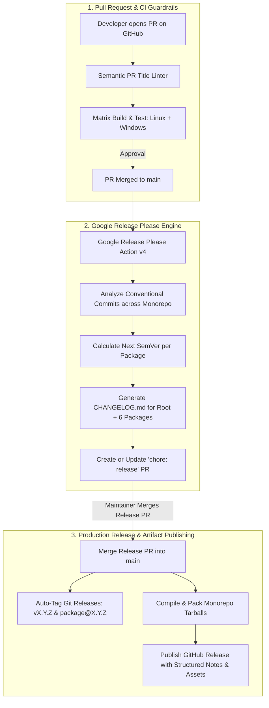

# FocalDOM CI/CD Investigation, Flaw Analysis & Autonomous SemVer Plan

**Document Path:** `TODO/Improve_CICD.md`  
**Parent Architecture:** [docs/README.md](../docs/README.md)  
**Audit Reference:** [TODO/AUDIT_REPORT.md](AUDIT_REPORT.md)  
**Suggested Implementation Branch:** `feat/release-please-cicd`  
**Status:** In Progress  

---

## Executive Summary & Flaw Investigation

A rigorous, line-by-line investigation of all workflow files in `.github/workflows/` (`ci.yml` and `release.yml`) revealed multiple critical architecture flaws, silent failure modes, cross-platform friction, and dead configuration inputs.

This document categorizes all discovered flaws across both files and provides a phased, production-grade implementation plan using **Google Release Please** (`google-github-actions/release-please-action@v4`) and modern CI hardening practices.

---

## Detailed Flaw & Vulnerability Audit Matrix

### 1. Investigation of `.github/workflows/ci.yml`

| ID | Severity | Category | File & Lines | Flaw / Vulnerability Description | Impact |
| :--- | :---: | :--- | :--- | :--- | :--- |
| **CI-01** | **Major** | Cross-Platform Failure | `ci.yml:50` | `playwright install --with-deps` attempts to invoke Linux `apt-get` on Windows runners in the matrix (`os: [ubuntu-latest, windows-latest]`). | Causes Playwright install errors/warnings and slowness on Windows runner jobs. |
| **CI-02** | **Medium** | Trigger Gaps | `ci.yml:4-7` | `push` triggers are hardcoded strictly to `main` and `'feat/**'`, ignoring `'fix/**'`, `'audit/**'`, `'chore/**'`, `'refactor/**'`, `'docs/**'`. | Commits pushed to non-`feat/` branches do not trigger CI until a PR is opened. |
| **CI-03** | **Medium** | CI Cache & Lockfile | `ci.yml:38-41` | Installs pnpm via global npm (`npm install -g pnpm`) without pnpm store caching, and uses `--no-frozen-lockfile`. | Slower CI build times and risk of non-reproducible dependency resolutions slipping past CI. |
| **CI-04** | **Minor** | Concurrency Race | `ci.yml:12-14` | `cancel-in-progress: true` cancels active builds unconditionally, including merges into `main`. | Pushing multiple merges to `main` cancels preceding validation jobs on `main`. |
| **CI-05** | **Medium** | Missing PR Linter | `ci.yml` | No Conventional Commits linter runs on PR titles/commits. | Allows non-standard commit messages that break automated SemVer changelog generators. |

---

### 2. Investigation of `.github/workflows/release.yml`

| ID | Severity | Category | File & Lines | Flaw / Vulnerability Description | Impact |
| :--- | :---: | :--- | :--- | :--- | :--- |
| **REL-01** | **Major** | Manual Scraping Flaw | `release.yml:59-75` | Scrapes `require('./package.json').version` from disk. If `package.json` was not manually bumped in Git, it silently outputs `Tag already exists` and aborts. | **Zero release automation.** Completely fails to automate versioning upon merging PRs. |
| **REL-02** | **Major** | Monorepo Blindness | `release.yml:62` | Only checks root `package.json`, completely ignoring `@focaldom/core`, `@focaldom/capture-playwright`, `@focaldom/renderer`, `@focaldom/studio`, `@focaldom/extension`, `apps/desktop`. | Sub-packages cannot be versioned or published independently or with synchronized tags. |
| **REL-03** | **Medium** | Dead Configuration | `release.yml:7-18` | `workflow_dispatch` accepts `inputs.bump_type` (`patch`, `minor`, `major`), but this input is **never referenced or used** in any step! | Confusing UI input that does absolutely nothing when triggered manually. |
| **REL-04** | **Medium** | Missing Artifact Assets | `release.yml:78-86` | `softprops/action-gh-release@v2` publishes empty source code zips with no compiled package tarballs, desktop `.exe` binaries, or CLI executables. | Users cannot download prebuilt binaries or bundles directly from GitHub Releases. |
| **REL-05** | **Medium** | Unformatted Changelogs | `release.yml:82` | Relies on `generate_release_notes: true` without grouping changes by package or commit category (Features, Fixes, Physics, Renderer). | Chaotic, unreadable release notes. |

---

## The Target Autonomous SemVer Architecture



---

## Automated Multi-Package Changelog Architecture

FocalDOM uses **Google Release Please** to maintain professional, human-readable, and categorised changelogs across both the root monorepo and each individual sub-package:

### 1. Dual-Tier Changelog Generation Hierarchy
- **Global Root Changelog ([`CHANGELOG.md`](../CHANGELOG.md)):** Aggregates all user-facing changes across all packages, providing high-level release overviews for full-stack consumers.
- **Sub-Package Changelogs (`packages/*/CHANGELOG.md` & `apps/desktop/CHANGELOG.md`):** Component-specific changelogs tracking granular library and application changes independently.

### 2. Conventional Commit Classification & Changelog Sections

Every commit merged to `main` is automatically categorized by Release Please into dedicated sections:

| Commit Prefix | Changelog Section | SemVer Bump | Example Commit |
| :--- | :--- | :---: | :--- |
| `feat:` / `feat(scope):` | **Features & Capabilities** | `MINOR` (`0.X.0`) | `feat(studio): add magnetic snap-to-event collision detection` |
| `fix:` / `fix(scope):` | **Bug Fixes** | `PATCH` (`0.0.X`) | `fix(renderer): guard against FFmpeg EPIPE process crashes` |
| `perf:` / `perf(scope):` | **Performance Optimizations** | `PATCH` (`0.0.X`) | `perf(capture): stream PNG frames direct to disk to prevent RAM bloat` |
| `refactor:` | **Code Refactoring** | `PATCH` (`0.0.X`) | `refactor(core): encapsulate cubic Bezier Catmull-Rom tangent solver` |
| `docs:` | **Documentation** | None (or `PATCH`) | `docs(readme): update quickstart and architecture diagrams` |
| `BREAKING CHANGE:` | **Breaking Changes** | `MAJOR` (`X.0.0`) | `feat(core)!: redesign CameraState transform matrix structure` |

### 3. Example of Auto-Generated `CHANGELOG.md` Entry

```markdown
# [0.2.0](https://github.com/dhaatrik/focal-dom/compare/v0.1.0...v0.2.0) (2026-08-16)

### Features
* **studio:** add magnetic snap-to-event collision detection with 10px proximity ([`7f2e1a`](https://github.com/dhaatrik/focal-dom/commit/7f2e1a))
* **renderer:** add native WebGPU WGSL compute shader pipeline ([`3b8c9d`](https://github.com/dhaatrik/focal-dom/commit/3b8c9d))

### Bug Fixes
* **extension:** implement 15s keepalive heartbeat preventing MV3 service worker sleep ([`57e3a7`](https://github.com/dhaatrik/focal-dom/commit/57e3a7))

### Performance Improvements
* **capture:** stream CDP screencast frames direct to disk reducing heap RAM usage by 95% ([`6049b0`](https://github.com/dhaatrik/focal-dom/commit/6049b0))
```

---

## Phase-Wise Solution & Implementation Checklist

---

### Phase 01: CI Workflow Hardening & Cross-Platform Reliability (`.github/workflows/ci.yml`)

> **Goal:** Ensure every push across all branch types triggers CI, eliminates cross-platform failures, makes builds deterministic with lockfile enforcement and PNPM store caching, and prevents production `main` jobs from being killed mid-run.

#### Sub-phase 01.1: Fix Cross-Platform Playwright Browser Installation (fixes CI-01)
- [x] **01.1.1** — Replace single `playwright install --with-deps` step with two OS-conditional steps.
- [x] **01.1.2** — Linux step: `if: runner.os == 'Linux'` → runs `playwright install --with-deps chromium chromium-headless-shell`.
- [x] **01.1.3** — Windows step: `if: runner.os == 'Windows'` → runs `playwright install chromium chromium-headless-shell` (no `apt-get`).
- [x] **01.1.4** — Verify the step names are clearly labeled for quick log scanning.

#### Sub-phase 01.2: Expand Branch Push Triggers (fixes CI-02)
- [x] **01.2.1** — Update `on.push.branches` list to include:
  - `main`
  - `'feat/**'`
  - `'fix/**'`
  - `'audit/**'`
  - `'chore/**'`
  - `'refactor/**'`
  - `'docs/**'`
- [x] **01.2.2** — Confirm `on.pull_request.branches` still targets `main` (no change needed, correct).

#### Sub-phase 01.3: Enable PNPM Store Caching & Lockfile Enforcement (fixes CI-03)
- [x] **01.3.1** — Replace `run: npm install -g pnpm@11.21.0` with `uses: pnpm/action-setup@v4` action.
- [x] **01.3.2** — Set `version: 11.21.0` and `run_install: false` in the setup action.
- [x] **01.3.3** — Add `cache: 'pnpm'` to `actions/setup-node@v4` to enable the PNPM store cache.
- [x] **01.3.4** — Switch `pnpm install` from `--no-frozen-lockfile` to `--frozen-lockfile` to enforce reproducible installs.
- [x] **01.3.5** — Keep `--ignore-scripts` to prevent post-install scripts from running in CI.

#### Sub-phase 01.4: Safe Concurrency Rule (fixes CI-04)
- [x] **01.4.1** — Change `cancel-in-progress: true` to `cancel-in-progress: ${{ github.ref != 'refs/heads/main' }}`.
- [x] **01.4.2** — This ensures jobs on `main` are never cancelled; only redundant branch builds are.

---

### Phase 02: PR Conventional Commit Title Linting & Gatekeeping (fixes CI-05)

> **Goal:** Automatically reject any PR whose title does not follow Conventional Commits specification, protecting changelog generation integrity.

#### Sub-phase 02.1: Add Semantic PR Title Validation Job
- [x] **02.1.1** — Add a new top-level `lint-pr-title` job to `.github/workflows/ci.yml`.
- [x] **02.1.2** — Set `if: github.event_name == 'pull_request'` so it only runs on PR events.
- [x] **02.1.3** — Use `amannn/action-semantic-pull-request@v5` with `GITHUB_TOKEN` in `env`.
- [x] **02.1.4** — Confirm the job runs on `ubuntu-latest` (fast, cheap runner).
- [x] **02.1.5** — Verify the job does NOT have `needs:` dependency on the matrix build (runs in parallel).

---

### Phase 03: Google Release Please Monorepo Engine Configuration

> **Goal:** Create the two JSON config files that define which packages Release Please tracks, what changelog sections are generated, and what the baseline versions are for each package.

#### Sub-phase 03.1: Author `release-please-config.json`
- [x] **03.1.1** — Create `release-please-config.json` at the repo root.
- [x] **03.1.2** — Set `"$schema"` to the official Release Please config schema URL.
- [x] **03.1.3** — Set top-level `"release-type": "node"` for all packages.
- [x] **03.1.4** — Set `"include-component-in-tag": true` to generate scoped tags like `core@0.2.0`.
- [x] **03.1.5** — Define `"packages"` map with entries for all 7 components:
  - `"."` → `focal-dom-monorepo` / `focal-dom`
  - `"packages/core"` → `@focaldom/core` / `core`
  - `"packages/capture-playwright"` → `@focaldom/capture-playwright` / `capture-playwright`
  - `"packages/renderer"` → `@focaldom/renderer` / `renderer`
  - `"packages/studio"` → `@focaldom/studio` / `studio`
  - `"packages/extension"` → `@focaldom/extension` / `extension`
  - `"apps/desktop"` → `@focaldom/desktop` / `desktop`
- [x] **03.1.6** — Define `"changelog-sections"` array without emojis:
  - `feat` → `"Features"`
  - `fix` → `"Bug Fixes"`
  - `perf` → `"Performance Improvements"`
  - `refactor` → `"Code Refactoring"` (hidden: false)
  - `docs` → `"Documentation"` (hidden: false)
  - `chore` → `"Miscellaneous Chores"` (hidden: true)
- [x] **03.1.7** — Validate JSON is syntactically correct (no trailing commas, valid schema).

#### Sub-phase 03.2: Author `.release-please-manifest.json`
- [x] **03.2.1** — Create `.release-please-manifest.json` at the repo root.
- [x] **03.2.2** — Map all 7 package paths to their baseline version `"0.1.0"`.
- [x] **03.2.3** — Verify the keys exactly match the package paths declared in `release-please-config.json`.
- [x] **03.2.4** — Validate JSON is syntactically correct.

---

### Phase 04: Modernized Autonomous Release Workflow (`.github/workflows/release.yml`)

> **Goal:** Replace the brittle manual version-scraping and dead `workflow_dispatch` input with a fully autonomous two-job pipeline: Release Please creates/updates a release PR, then a second Windows job builds and uploads installer assets to GitHub Releases.

#### Sub-phase 04.1: Replace Legacy Job with Release Please Action (fixes REL-01, REL-02, REL-03, REL-05)
- [x] **04.1.1** — Remove the legacy `release` job and its manual version-scraping steps entirely.
- [x] **04.1.2** — Remove the dead `workflow_dispatch.inputs.bump_type` input.
- [x] **04.1.3** — Keep `on.push.branches: [main]` trigger only (release workflow only fires on main merges).
- [x] **04.1.4** — Add new `release-please` job:
  - runs-on: `ubuntu-latest`
  - step: `google-github-actions/release-please-action@v4` with `config-file` and `manifest-file`.
  - outputs: `releases_created` and `paths_released` for use by the downstream job.
- [x] **04.1.5** — Set `permissions: contents: write, pull-requests: write` at the workflow level.
- [x] **04.1.6** — Verify Release Please action uses `id: release` to expose outputs.

#### Sub-phase 04.2: Add Windows Release Asset Build & Upload Job (fixes REL-04)
- [x] **04.2.1** — Add new `build-and-publish-windows` job with `needs: release-please`.
- [x] **04.2.2** — Set `if: ${{ needs.release-please.outputs.releases_created == 'true' }}` so it only runs when a real release was created.
- [x] **04.2.3** — Set `runs-on: windows-latest` (Electron/NSIS builder requires Windows for `.exe` output).
- [x] **04.2.4** — Add checkout, PNPM setup (`pnpm/action-setup@v4`), Node setup with `cache: 'pnpm'`, and install steps.
- [x] **04.2.5** — Add ordered build steps:
  1. `pnpm --filter @focaldom/core build`
  2. `pnpm --filter @focaldom/renderer build`
  3. `pnpm --filter @focaldom/studio build`
  4. `pnpm --filter @focaldom/extension build`
  5. `pnpm --filter @focaldom/desktop build`
- [x] **04.2.6** — Add PowerShell step to zip the built Chrome extension:
  - `Compress-Archive -Path packages/extension/dist/* -DestinationPath packages/extension/dist/focaldom-chrome-extension.zip -Force`
- [x] **04.2.7** — Add electron-builder step: `pnpm --filter @focaldom/desktop exec electron-builder --win`.
- [x] **04.2.8** — Add `softprops/action-gh-release@v2` upload step with glob patterns:
  - `apps/desktop/dist-package/FocalDOM-Setup-*.exe`
  - `apps/desktop/dist-package/FocalDOM-*.exe`
  - `apps/desktop/dist-package/FocalDOM-*.zip`
  - `packages/extension/dist/focaldom-chrome-extension.zip`
- [x] **04.2.9** — Set `tag_name: ${{ needs.release-please.outputs.tag_name }}` to attach assets to the correct release.
- [x] **04.2.10** — Set `env: GITHUB_TOKEN: ${{ secrets.GITHUB_TOKEN }}` on the upload step.

---

### Phase 05: Validation, Testing & Verification

> **Goal:** Verify all generated files are syntactically and semantically correct, run the full test suite, and update all tracking checklists.

#### Sub-phase 05.1: Validate JSON Config Files
- [x] **05.1.1** — Parse `release-please-config.json` with `node -e "require('./release-please-config.json')"` — must exit 0.
- [x] **05.1.2** — Parse `.release-please-manifest.json` with `node -e "require('./.release-please-manifest.json')"` — must exit 0.
- [x] **05.1.3** — Confirm `packages` keys in config exactly match keys in manifest.

#### Sub-phase 05.2: Validate YAML Workflow Syntax
- [x] **05.2.1** — Read `ci.yml` top-to-bottom to ensure indentation is consistent and all `uses:` references are valid.
- [x] **05.2.2** — Read `release.yml` top-to-bottom to verify job dependency chain (`needs: release-please`) and `if:` condition syntax.

#### Sub-phase 05.3: Run Full Test Suite
- [x] **05.3.1** — Run `pnpm typecheck` — must complete with 0 TypeScript errors.
- [x] **05.3.2** — Run `pnpm test` — must pass all 16 test files (35 tests).

#### Sub-phase 05.4: Update Documentation & Checklists
- [x] **05.4.1** — Update status header in this file from `In Progress` to `Complete`.
- [x] **05.4.2** — Update `TODO/README.md` status column for `Improve_CICD.md` row.

---

## Acceptance Criteria & Quality Checklist

1. **Cross-Platform CI Stability:** `.github/workflows/ci.yml` runs without errors on both Linux (`ubuntu-latest`) and Windows (`windows-latest`).
2. **Lockfile Enforcement:** `pnpm install --frozen-lockfile` is used in CI so any lockfile drift fails fast.
3. **PNPM Store Caching:** `pnpm/action-setup@v4` + `cache: 'pnpm'` reduces dependency install time on warm runners.
4. **All Branch Types Trigger CI:** Pushes to `feat/**`, `fix/**`, `audit/**`, `chore/**`, `refactor/**`, `docs/**`, and `main` all run the CI matrix.
5. **Safe Concurrency:** Builds on `main` are never cancelled mid-run; only redundant branch builds are.
6. **PR Title Linting:** All PRs with non-conventional titles are automatically rejected by `amannn/action-semantic-pull-request@v5`.
7. **Deterministic Versioning:** All merges to `main` with Conventional Commits automatically update the open Release PR with exact SemVer bumps.
8. **Multi-Package Changelogs:** Each workspace package (`packages/*`, `apps/*`, root) maintains a clean, dedicated `CHANGELOG.md` with sections: Features, Bug Fixes, Performance Improvements, Documentation.
9. **Windows Installer Asset:** GitHub Releases include `FocalDOM-Setup-*.exe` and `focaldom-chrome-extension.zip` as downloadable assets.
10. **Zero Human Overhead:** Releases are created automatically when the Release PR is merged — no manual `npm version` or tag pushing required.
