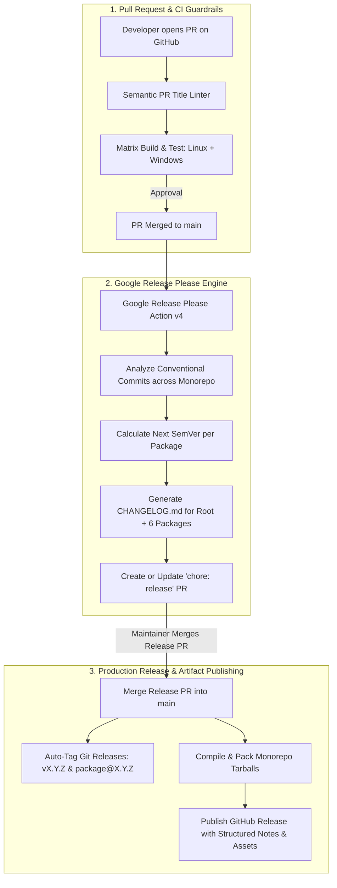

# FocalDOM CI/CD Investigation, Flaw Analysis & Autonomous SemVer Plan 🚀📦

**Document Path:** `TODO/Improve_CICD.md`  
**Parent Architecture:** [docs/README.md](../docs/README.md)  
**Audit Reference:** [TODO/AUDIT_REPORT.md](AUDIT_REPORT.md)  
**Suggested Implementation Branch:** `feat/release-please-cicd`  
**Status:** 🚀 Ready for Implementation  

---

## 📌 Executive Summary & Flaw Investigation

A rigorous, line-by-line investigation of all workflow files in `.github/workflows/` (`ci.yml` and `release.yml`) revealed multiple critical architecture flaws, silent failure modes, cross-platform friction, and dead configuration inputs.

This document categorizes all discovered flaws across both files and provides a phased, production-grade implementation plan using **Google Release Please** (`google-github-actions/release-please-action@v4`) and modern CI hardening practices.

---

## 🔍 Detailed Flaw & Vulnerability Audit Matrix

### 1. Investigation of `.github/workflows/ci.yml`

| ID | Severity | Category | File & Lines | Flaw / Vulnerability Description | Impact |
| :--- | :---: | :--- | :--- | :--- | :--- |
| **CI-01** | 🔴 **Major** | Cross-Platform Failure | `ci.yml:50` | `playwright install --with-deps` attempts to invoke Linux `apt-get` on Windows runners in the matrix (`os: [ubuntu-latest, windows-latest]`). | Causes Playwright install errors/warnings and slowness on Windows runner jobs. |
| **CI-02** | 🟡 **Medium** | Trigger Gaps | `ci.yml:4-7` | `push` triggers are hardcoded strictly to `main` and `'feat/**'`, ignoring `'fix/**'`, `'audit/**'`, `'chore/**'`, `'refactor/**'`, `'docs/**'`. | Commits pushed to non-`feat/` branches do not trigger CI until a PR is opened. |
| **CI-03** | 🟡 **Medium** | CI Cache & Lockfile | `ci.yml:38-41` | Installs pnpm via global npm (`npm install -g pnpm`) without pnpm store caching, and uses `--no-frozen-lockfile`. | Slower CI build times and risk of non-reproducible dependency resolutions slipping past CI. |
| **CI-04** | 🟢 **Minor** | Concurrency Race | `ci.yml:12-14` | `cancel-in-progress: true` cancels active builds unconditionally, including merges into `main`. | Pushing multiple merges to `main` cancels preceding validation jobs on `main`. |
| **CI-05** | 🟡 **Medium** | Missing PR Linter | `ci.yml` | No Conventional Commits linter runs on PR titles/commits. | Allows non-standard commit messages that break automated SemVer changelog generators. |

---

### 2. Investigation of `.github/workflows/release.yml`

| ID | Severity | Category | File & Lines | Flaw / Vulnerability Description | Impact |
| :--- | :---: | :--- | :--- | :--- | :--- |
| **REL-01** | 🔴 **Major** | Manual Scraping Flaw | `release.yml:59-75` | Scrapes `require('./package.json').version` from disk. If `package.json` was not manually bumped in Git, it silently outputs `Tag already exists` and aborts. | **Zero release automation.** Completely fails to automate versioning upon merging PRs. |
| **REL-02** | 🔴 **Major** | Monorepo Blindness | `release.yml:62` | Only checks root `package.json`, completely ignoring `@focaldom/core`, `@focaldom/capture-playwright`, `@focaldom/renderer`, `@focaldom/studio`, `@focaldom/extension`, `apps/desktop`. | Sub-packages cannot be versioned or published independently or with synchronized tags. |
| **REL-03** | 🟡 **Medium** | Dead Configuration | `release.yml:7-18` | `workflow_dispatch` accepts `inputs.bump_type` (`patch`, `minor`, `major`), but this input is **never referenced or used** in any step! | Confusing UI input that does absolutely nothing when triggered manually. |
| **REL-04** | 🟡 **Medium** | Missing Artifact Assets | `release.yml:78-86` | `softprops/action-gh-release@v2` publishes empty source code zips with no compiled package tarballs, desktop `.exe` binaries, or CLI executables. | Users cannot download prebuilt binaries or bundles directly from GitHub Releases. |
| **REL-05** | 🟡 **Medium** | Unformatted Changelogs | `release.yml:82` | Relies on `generate_release_notes: true` without grouping changes by package or commit category (Features, Fixes, Physics, Renderer). | Chaotic, unreadable release notes. |

---

## 🏗️ The Target Autonomous SemVer Architecture



---

## 📝 Automated Multi-Package Changelog Architecture

FocalDOM uses **Google Release Please** to maintain professional, human-readable, and categorised changelogs across both the root monorepo and each individual sub-package:

### 1. Dual-Tier Changelog Generation Hierarchy
- **Global Root Changelog ([`CHANGELOG.md`](../CHANGELOG.md)):** Aggregates all user-facing changes across all packages, providing high-level release overviews for full-stack consumers.
- **Sub-Package Changelogs (`packages/*/CHANGELOG.md` & `apps/desktop/CHANGELOG.md`):** Component-specific changelogs tracking granular library and application changes independently.

### 2. Conventional Commit Classification & Changelog Sections

Every commit merged to `main` is automatically categorized by Release Please into dedicated sections:

| Commit Prefix | Changelog Section | SemVer Bump | Example Commit |
| :--- | :--- | :---: | :--- |
| `feat:` / `feat(scope):` | ✨ **Features & Capabilities** | `MINOR` (`0.X.0`) | `feat(studio): add magnetic snap-to-event collision detection` |
| `fix:` / `fix(scope):` | 🐛 **Bug Fixes** | `PATCH` (`0.0.X`) | `fix(renderer): guard against FFmpeg EPIPE process crashes` |
| `perf:` / `perf(scope):` | ⚡ **Performance Optimizations** | `PATCH` (`0.0.X`) | `perf(capture): stream PNG frames direct to disk to prevent RAM bloat` |
| `refactor:` | ♻️ **Code Refactoring** | `PATCH` (`0.0.X`) | `refactor(core): encapsulate cubic Bezier Catmull-Rom tangent solver` |
| `docs:` | 📝 **Documentation** | None (or `PATCH`) | `docs(readme): update quickstart and architecture diagrams` |
| `BREAKING CHANGE:` | 🚨 **Breaking Changes** | `MAJOR` (`X.0.0`) | `feat(core)!: redesign CameraState transform matrix structure` |

### 3. Example of Auto-Generated `CHANGELOG.md` Entry

```markdown
# [0.2.0](https://github.com/dhaatrik/focal-dom/compare/v0.1.0...v0.2.0) (2026-08-16)

### ✨ Features
* **studio:** add magnetic snap-to-event collision detection with 10px proximity ([`7f2e1a`](https://github.com/dhaatrik/focal-dom/commit/7f2e1a))
* **renderer:** add native WebGPU WGSL compute shader pipeline ([`3b8c9d`](https://github.com/dhaatrik/focal-dom/commit/3b8c9d))
* **capture:** support Shadow DOM and nested same-origin iframe traversal ([`9a4f2e`](https://github.com/dhaatrik/focal-dom/commit/9a4f2e))

### 🐛 Bug Fixes
* **extension:** implement 15s keepalive heartbeat preventing MV3 service worker sleep ([`57e3a7`](https://github.com/dhaatrik/focal-dom/commit/57e3a7))
* **desktop:** add single-instance lock preventing multiple duplicate windows ([`00204d`](https://github.com/dhaatrik/focal-dom/commit/00204d))

### ⚡ Performance Improvements
* **capture:** stream CDP screencast frames direct to disk reducing heap RAM usage by 95% ([`6049b0`](https://github.com/dhaatrik/focal-dom/commit/6049b0))
```

---

## 🛠️ Phase-Wise Solution & Implementation Checklist

### Phase 01: CI Workflow Hardening & Cross-Platform Reliability (`.github/workflows/ci.yml`)
- [ ] **Sub-phase 01.1: Fix Cross-Platform Playwright Browser Installation**
  - Use conditional execution for Linux (`--with-deps`) vs Windows:
    ```yaml
    - name: Install Playwright Browsers (Linux)
      if: runner.os == 'Linux'
      run: pnpm --filter @focaldom/capture-playwright exec playwright install --with-deps chromium chromium-headless-shell

    - name: Install Playwright Browsers (Windows)
      if: runner.os == 'Windows'
      run: pnpm --filter @focaldom/capture-playwright exec playwright install chromium chromium-headless-shell
    ```
- [ ] **Sub-phase 01.2: Expand Branch Push Triggers**
  - Update `on.push.branches` to trigger across all development and feature branch patterns (`main`, `'feat/**'`, `'fix/**'`, `'audit/**'`, `'chore/**'`, `'refactor/**'`, `'docs/**'`).
- [ ] **Sub-phase 01.3: Enable Fast PNPM Caching**
  - Integrate `pnpm/action-setup@v4` with `actions/setup-node@v4` caching:
    ```yaml
    - name: Install pnpm
      uses: pnpm/action-setup@v4
      with:
        version: 11.21.0
        run_install: false

    - name: Setup Node.js 22.x
      uses: actions/setup-node@v4
      with:
        node-version: 22.x
        cache: 'pnpm'

    - name: Install Dependencies
      run: pnpm install --frozen-lockfile --ignore-scripts
    ```
- [ ] **Sub-phase 01.4: Safe Concurrency Rule**
  - Configure `cancel-in-progress: ${{ github.ref != 'refs/heads/main' }}` so pushes to `main` are never aborted mid-execution.

---

### Phase 02: PR Conventional Commit Linting & Gatekeeping
- [ ] **Sub-phase 02.1: Add Semantic PR Title Validation Job**
  - Add `amannn/action-semantic-pull-request@v5` to validate that all incoming PRs follow Conventional Commits (`feat(...)`, `fix(...)`, `docs(...)`, `perf(...)`, `refactor(...)`, `feat!:`):
    ```yaml
    jobs:
      lint-pr-title:
        name: Validate Conventional PR Title
        runs-on: ubuntu-latest
        if: github.event_name == 'pull_request'
        steps:
          - uses: amannn/action-semantic-pull-request@v5
            env:
              GITHUB_TOKEN: ${{ secrets.GITHUB_TOKEN }}
    ```

---

### Phase 03: Google Release Please Monorepo Engine Configuration
- [ ] **Sub-phase 03.1: Author `release-please-config.json`**
  - Configure individual package release components, changelog paths, and release types:
    ```json
    {
      "$schema": "https://raw.githubusercontent.com/googleapis/release-please/main/schemas/config.json",
      "release-type": "node",
      "include-component-in-tag": true,
      "packages": {
        ".": {
          "package-name": "focal-dom-monorepo",
          "component": "focal-dom",
          "changelog-path": "CHANGELOG.md"
        },
        "packages/core": {
          "package-name": "@focaldom/core",
          "component": "core",
          "changelog-path": "CHANGELOG.md"
        },
        "packages/capture-playwright": {
          "package-name": "@focaldom/capture-playwright",
          "component": "capture-playwright",
          "changelog-path": "CHANGELOG.md"
        },
        "packages/renderer": {
          "package-name": "@focaldom/renderer",
          "component": "renderer",
          "changelog-path": "CHANGELOG.md"
        },
        "packages/studio": {
          "package-name": "@focaldom/studio",
          "component": "studio",
          "changelog-path": "CHANGELOG.md"
        },
        "packages/extension": {
          "package-name": "@focaldom/extension",
          "component": "extension",
          "changelog-path": "CHANGELOG.md"
        },
        "apps/desktop": {
          "package-name": "@focaldom/desktop",
          "component": "desktop",
          "changelog-path": "CHANGELOG.md"
        }
      },
      "changelog-sections": [
        { "type": "feat", "section": "✨ Features", "hidden": false },
        { "type": "fix", "section": "🐛 Bug Fixes", "hidden": false },
        { "type": "perf", "section": "⚡ Performance Improvements", "hidden": false },
        { "type": "refactor", "section": "♻️ Code Refactoring", "hidden": false },
        { "type": "docs", "section": "📝 Documentation", "hidden": false },
        { "type": "chore", "section": "🔧 Miscellaneous Chores", "hidden": true }
      ]
    }
    ```
- [ ] **Sub-phase 03.2: Author `.release-please-manifest.json`**
  - Establish exact baseline versions:
    ```json
    {
      ".": "0.1.0",
      "packages/core": "0.1.0",
      "packages/capture-playwright": "0.1.0",
      "packages/renderer": "0.1.0",
      "packages/studio": "0.1.0",
      "packages/extension": "0.1.0",
      "apps/desktop": "0.1.0"
    }
    ```

---

### Phase 04: Modernized Autonomous Release Workflow (`.github/workflows/release.yml`)
- [ ] **Sub-phase 04.1: Modernize `release.yml` with Release Please Action**
  - Replace the dead manual scraping steps with autonomous release creation and conditional artifact build & packaging:
    ```yaml
    name: Automated Release (Release Please)

    on:
      push:
        branches:
          - main

    permissions:
      contents: write
      pull-requests: write

    jobs:
      release-please:
        name: Release Please (SemVer & Changelogs)
        runs-on: ubuntu-latest
        outputs:
          releases_created: ${{ steps.release.outputs.releases_created }}
          paths_released: ${{ steps.release.outputs.paths_released }}
        steps:
          - uses: google-github-actions/release-please-action@v4
            id: release
            with:
              config-file: release-please-config.json
              manifest-file: .release-please-manifest.json

      build-and-publish:
        name: Build & Package Released Artifacts
        needs: release-please
        if: ${{ needs.release-please.outputs.releases_created == 'true' }}
        runs-on: ubuntu-latest
        steps:
          - name: Checkout Repository
            uses: actions/checkout@v4

          - name: Install pnpm
            uses: pnpm/action-setup@v4
            with:
              version: 11.21.0

          - name: Setup Node.js 22.x
            uses: actions/setup-node@v4
            with:
              node-version: 22.x
              cache: 'pnpm'

          - name: Install Dependencies
            run: pnpm install --frozen-lockfile --ignore-scripts

          - name: Typecheck & Build Monorepo
            run: |
              pnpm typecheck
              pnpm build

          - name: Run Tests
            run: pnpm test
    ```

---

### Phase 05: Validation, Testing & Verification Matrix
- [ ] **Sub-phase 05.1: Validate JSON Config Schemas**
  - Validate `release-please-config.json` against the official Google schema.
- [ ] **Sub-phase 05.2: Test Dry-Run Workflow Syntax**
  - Validate GitHub Action YAML syntax and dependency graphs with `pnpm test` and `tsc -b`.

---

## ✅ Acceptance Criteria & Quality Checklist

1. **Cross-Platform CI Stability:** `.github/workflows/ci.yml` runs without errors on both Linux (`ubuntu-latest`) and Windows (`windows-latest`).
2. **Deterministic Versioning:** All merges to `main` with Conventional Commits correctly update the open Release PR with exact SemVer bumps.
3. **Multi-Package Changelogs:** Each workspace package (`packages/*`, `apps/*`, root) maintains a clean, dedicated `CHANGELOG.md`.
4. **Zero Human Overhead:** Releases are created automatically when the Release PR is merged.
