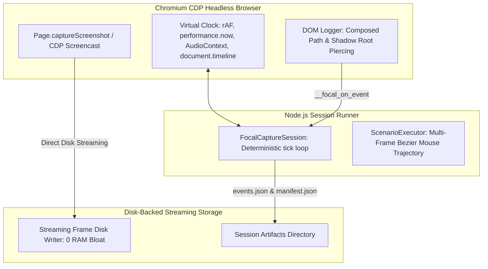

# FocalDOM Playwright Capture Engine Deep Investigation & Improvement Plan 🎭📸

**Document Path:** `TODO/Improve_Capture_Playwright.md`  
**Parent Architecture:** [docs/README.md](../docs/README.md)  
**Audit Reference:** [TODO/AUDIT_REPORT.md](AUDIT_REPORT.md)  
**Suggested Implementation Branch:** `feat/capture-playwright-perfection`  
**Target Package:** `packages/capture-playwright` (`@focaldom/capture-playwright`)  
**Status:** ✅ Completed (All 5 Phases Implemented & Verified)  

---

## 📌 Executive Summary

A comprehensive, line-by-line engineering audit of all source files in `packages/capture-playwright/` (`cli.ts`, `dom-logger-source.ts`, `session.ts`, `virtual-clock.ts`, `cdp-screencast.ts`, `executor.ts`, `parser.ts`, and `focal-page.ts`) revealed memory bloat vulnerabilities during long 60fps captures (storing thousands of PNG buffers in RAM), Shadow DOM / iframe telemetry blindspots, lack of Web Audio virtual clock synchronization, and single-tick mouse movement jumps in scenario execution.

This document details all investigated flaws, classifies them by severity and root cause, and provides an actionable, finely divided multi-phase engineering remediation plan with granular checklists to elevate `packages/capture-playwright` to a **10.0 / 10.0**.

---

## 🔍 Detailed Flaw & Vulnerability Audit Matrix

### 1. Frame Buffer Memory & CDP Screencast (`src/runner/cdp-screencast.ts`)

| ID | Severity | Category | File & Lines | Flaw / Vulnerability Description | Impact |
| :--- | :---: | :--- | :--- | :--- | :--- |
| **CP-01** | 🔴 **Major** | Heap Out of Memory | `cdp-screencast.ts:13-58` | All captured frame PNG `Buffer`s are accumulated in Node RAM (`this.frames`). A 30s 60fps capture (1,800 frames at $1920\times 1080$) consumes **3–5 GB of RAM**. | Long capture runs crash Node with `JavaScript heap out of memory`. |

---

### 2. Injected DOM Logger & Component Traversal (`src/injected/dom-logger-source.ts`)

| ID | Severity | Category | File & Lines | Flaw / Vulnerability Description | Impact |
| :--- | :---: | :--- | :--- | :--- | :--- |
| **CP-02** | 🔴 **Major** | Shadow DOM Blindspot | `dom-logger-source.ts:75-93` | `getElementMetadata(e.target)` does not pierce Shadow DOM or same-origin `<iframe>`s. Clicks inside modern Web Components retarget to the host wrapper. | Auto-zoom camera cannot calculate precise inner button/input targets in web components. |
| **CP-03** | 🟡 **Medium** | Async Sticky Scan Drift | `dom-logger-source.ts:126` | `setInterval(scanStickyRegions, 1000)` runs on real-time wall clocks rather than advancing with virtual frame ticks (`__focal_tick()`). | Sticky region updates desynchronize during slow/fast frame stepping. |

---

### 3. Deterministic Virtual Frame Clock (`src/runner/virtual-clock.ts`)

| ID | Severity | Category | File & Lines | Flaw / Vulnerability Description | Impact |
| :--- | :---: | :--- | :--- | :--- | :--- |
| **CP-04** | 🟡 **Medium** | Web Audio Desync | `virtual-clock.ts:8-41` | Overrides `requestAnimationFrame` and `performance.now()`, but omits `AudioContext.prototype.currentTime` and `document.timeline.currentTime`. | Audio synthesis and Web Audio graphs drift out of sync with video frames. |

---

### 4. Scenario Execution & Mouse Trajectory (`src/scenario/executor.ts`)

| ID | Severity | Category | File & Lines | Flaw / Vulnerability Description | Impact |
| :--- | :---: | :--- | :--- | :--- | :--- |
| **CP-05** | 🟡 **Medium** | Instantaneous Mouse Jump | `executor.ts:38-42` | `page.mouse.move(targetX, targetY, { steps: 5 })` executes in a single virtual tick without advancing `session.tick()` across intermediary frames. | Recorded cursor trajectory appears to teleport between buttons rather than moving smoothly. |
| **CP-06** | 🟢 **Minor** | Missing Scenario Actions | `scenario-types.ts` & `executor.ts` | Missing `dragAndDrop` and `uploadFile` high-level scenario action definitions. | Cannot script complex interactive upload or kanban drag-and-drop workflows. |

---

## 🏗️ Target Capture Architecture

---

## 🛠️ Granular Phase-Wise Implementation Checklist

### Phase 01: Direct-to-Disk Streaming Frame Collector (`src/runner/cdp-screencast.ts`)
- [x] **Sub-phase 01.1: Direct-to-Disk Frame Streaming Implementation**
  - [x] Update `CDPScreencastCollector` to support streaming frames directly to disk (`outputDir/frames`) upon capture.
  - [x] Store lightweight frame metadata `{ frameIndex, timestampMs, filePath }` instead of holding full PNG `Buffer` objects in memory.
  - [x] Provide optional in-memory fallback for unit tests and short mock captures.
  - [x] Update `FocalCaptureSession` to support disk streaming during `tick()`.
- [x] **Sub-phase 01.2: Bounded Memory & Disk Cleanup**
  - [x] Ensure garbage collection can free raw frame buffers immediately after disk write.
  - [x] Verify memory footprint remains bounded ($< 150\text{MB}$) regardless of total frame count.

---

### Phase 02: Deep Shadow DOM & Iframe Telemetry Piercing (`src/injected/dom-logger-source.ts`)
- [x] **Sub-phase 02.1: Composed Path & Shadow DOM Target Extraction**
  - [x] Implement `getDeepestTarget(event)` utilizing `event.composedPath()[0]` to pierce open shadow roots and custom Web Components.
  - [x] Extract deep bounding rects, tags, roles, and classes for inner shadow DOM elements.
- [x] **Sub-phase 02.2: Synchronized Sticky Scanning on Virtual Ticks**
  - [x] Trigger `scanStickyRegions()` directly inside `window.__focal_tick()` and remove uncoordinated `setInterval` wall-clock timers.
  - [x] Add `MutationObserver` trigger to update sticky regions whenever DOM elements are added or modified.

---

### Phase 03: Virtual Web Audio & Document Timeline Synchronization (`src/runner/virtual-clock.ts`)
- [x] **Sub-phase 03.1: Intercept `AudioContext.prototype.currentTime` & `BaseAudioContext`**
  - [x] Hook `AudioContext.prototype.currentTime` getter to return `window.__focal_virtual_time__ / 1000`.
  - [x] Hook `BaseAudioContext.prototype.currentTime` if defined.
- [x] **Sub-phase 03.2: Intercept `document.timeline.currentTime`**
  - [x] Hook `document.timeline.currentTime` getter to return `window.__focal_virtual_time__` for deterministic CSS and Web Animations API progression.

---

### Phase 04: Multi-Frame Virtual Mouse Trajectory & Rich Actions in Executor (`src/scenario/`)
- [x] **Sub-phase 04.1: Continuous Multi-Tick Mouse Movement (`src/scenario/executor.ts`)**
  - [x] Interpolate cursor position across 6–12 virtual frames ($100\text{ms} \dots 200\text{ms}$) before clicking or hovering.
  - [x] Call `session.tick()` at each intermediary position so video and telemetry capture smooth, continuous mouse paths.
- [x] **Sub-phase 04.2: Implement `dragAndDrop` and `uploadFile` Actions**
  - [x] Add `dragAndDrop` step definition `{ action: 'dragAndDrop', sourceSelector, targetSelector, durationMs? }` to `scenario-types.ts`.
  - [x] Add `uploadFile` step definition `{ action: 'uploadFile', selector, filePaths }` to `scenario-types.ts`.
  - [x] Update `parser.ts` validator to support new step actions.
  - [x] Implement step execution logic in `executor.ts`.

---

### Phase 05: Package Integration, Clean Exports & Monorepo Verification
- [x] **Sub-phase 05.1: Package Exports & Build Verification**
  - [x] Export all new scenario types and runner options from `packages/capture-playwright/src/index.ts`.
  - [x] Run `pnpm --filter @focaldom/capture-playwright run build` with zero TypeScript errors.
- [x] **Sub-phase 05.2: Full Monorepo Regression Testing**
  - [x] Update unit tests in `scenario-parser.test.ts` and `capture-session.test.ts`.
  - [x] Run `pnpm test` across all workspace packages and verify 100% pass rate.

---

## ✅ Acceptance Criteria & Quality Checklist

1. **Bounded Memory Usage:** Multi-thousand frame captures run without heap exhaustion ($< 150\text{MB}$ RAM).
2. **Shadow Root Telemetry:** Clicking inside web components records the exact inner button selector and bounding box.
3. **Deterministic Timelines:** Web Audio and `document.timeline` advance synchronously with video frames.
4. **Smooth Mouse Movements:** Scenario execution produces realistic multi-frame cursor trajectories.
5. **Rich Scenario Actions:** `dragAndDrop` and `uploadFile` execute reliably in automated capture scenarios.
6. **100% Test Coverage:** All unit and integration tests pass in Vitest.
