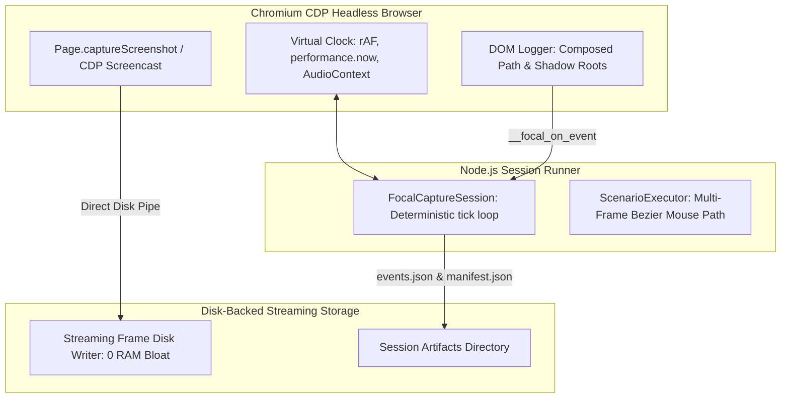

# FocalDOM Playwright Capture Engine Deep Investigation & Improvement Plan 🎭📸

**Document Path:** `TODO/Improve_Capture_Playwright.md`  
**Parent Plan:** [docs/Technical Architecture & Engineering Plan.md](../docs/Technical%20Architecture%20&%20Engineering%20Plan.md)  
**Audit Reference:** [TODO/AUDIT_REPORT.md](AUDIT_REPORT.md)  
**Suggested Implementation Branch:** `feat/capture-playwright-perfection`  
**Target Package:** `packages/capture-playwright` (`@focaldom/capture-playwright`)  
**Status:** 🚀 Ready for Implementation  

---

## 📌 Executive Summary

A comprehensive, line-by-line engineering audit of all source files in `packages/capture-playwright/` (`cli.ts`, `dom-logger-source.ts`, `session.ts`, `virtual-clock.ts`, `cdp-screencast.ts`, `executor.ts`, `parser.ts`, and `focal-page.ts`) revealed memory bloat vulnerabilities during long 60fps captures (storing thousands of PNG buffers in RAM), Shadow DOM / iframe telemetry blindspots, lack of Web Audio virtual clock synchronization, and single-tick mouse movement jumps in scenario execution.

This document details all investigated flaws, classifies them by severity and root cause, and provides an actionable 5-phase engineering remediation plan to elevate `packages/capture-playwright` to a **10.0 / 10.0**.

---

## 🔍 Detailed Flaw & Vulnerability Audit Matrix

### 1. Frame Buffer Memory & CDP Screencast (`src/runner/cdp-screencast.ts`)

| ID | Severity | Category | File & Lines | Flaw / Vulnerability Description | Impact |
| :--- | :---: | :--- | :--- | :--- | :--- |
| **CP-01** | 🔴 **Major** | Heap Out of Memory | `cdp-screencast.ts:13-58` | All captured frame PNG `Buffer`s are accumulated in Node RAM (`this.frames`). A 30s 60fps capture (1,800 frames at $1920\times 1080$) consumes **3–5 GB of RAM**. | Long capture runs crash Node with `JavaScript heap out of memory`. |

---

### 2. Injected DOM Logger & Component Traversal (`src/injected/dom-logger-source.ts`)

| ID | Severity | Category | File & Lines | Flaw / Vulnerability Description | Impact |
| :--- | :---: | :--- | :--- | :--- | :--- |
| **CP-02** | 🔴 **Major** | Shadow DOM Blindspot | `dom-logger-source.ts:75-93` | `getElementMetadata(e.target)` does not pierce Shadow DOM or same-origin `<iframe>`s. Clicks inside modern Web Components retarget to the host wrapper. | Auto-zoom camera cannot calculate precise inner button/input targets in web components. |
| **CP-03** | 🟡 **Medium** | Async Sticky Scan Drift | `dom-logger-source.ts:126` | `setInterval(scanStickyRegions, 1000)` runs on real-time wall clocks rather than advancing with virtual frame ticks (`__focal_tick()`). | Sticky region updates desynchronize during slow/fast frame stepping. |

---

### 3. Deterministic Virtual Frame Clock (`src/runner/virtual-clock.ts`)

| ID | Severity | Category | File & Lines | Flaw / Vulnerability Description | Impact |
| :--- | :---: | :--- | :--- | :--- | :--- |
| **CP-04** | 🟡 **Medium** | Web Audio Desync | `virtual-clock.ts:8-41` | Overrides `requestAnimationFrame` and `performance.now()`, but omits `AudioContext.prototype.currentTime` and `document.timeline.currentTime`. | Audio synthesis and Web Audio graphs drift out of sync with video frames. |

---

### 4. Scenario Execution & Mouse Trajectory (`src/scenario/executor.ts`)

| ID | Severity | Category | File & Lines | Flaw / Vulnerability Description | Impact |
| :--- | :---: | :--- | :--- | :--- | :--- |
| **CP-05** | 🟡 **Medium** | Instantaneous Mouse Jump | `executor.ts:38-42` | `page.mouse.move(targetX, targetY, { steps: 5 })` executes in a single virtual tick without advancing `session.tick()` across intermediary frames. | Recorded cursor trajectory appears to teleport between buttons rather than moving smoothly. |
| **CP-06** | 🟢 **Minor** | Missing Scenario Actions | `scenario-types.ts` & `executor.ts` | Missing `dragAndDrop` and `uploadFile` high-level scenario action definitions. | Cannot script complex interactive upload or kanban drag-and-drop workflows. |

---

## 🏗️ Target Capture Architecture



---

## 🛠️ Phase-Wise Solution & Implementation Checklist

### Phase 01: Streaming Disk Cache for Screencast Frames (`src/runner/cdp-screencast.ts`)
- [ ] **Sub-phase 01.1: Direct-to-Disk Frame Streaming**
  - Write each captured frame directly to disk as soon as it arrives, storing only metadata and file paths in memory:
    ```typescript
    public async captureFrame(frameIndex: number, timestampMs: number, framesDir: string): Promise<string> {
      const buffer = await this.captureScreenshotBuffer();
      const fileName = `frame_${String(frameIndex).padStart(6, '0')}.png`;
      const filePath = join(framesDir, fileName);
      await fs.writeFile(filePath, buffer);
      return filePath;
    }
    ```
- [ ] **Sub-phase 01.2: Bounded Memory Footprint**
  - Verify that memory usage remains constant ($< 200\text{MB}$) regardless of whether 100 or 10,000 frames are captured.

---

### Phase 02: Deep Shadow DOM & Iframe Telemetry Piercing (`src/injected/dom-logger-source.ts`)
- [ ] **Sub-phase 02.1: Composed Path Element Extraction**
  - Use `e.composedPath()[0]` to extract the exact interactive target within open shadow roots:
    ```javascript
    function getDeepestTarget(event) {
      if (typeof event.composedPath === 'function') {
        const path = event.composedPath();
        if (path && path.length > 0) return path[0];
      }
      return event.target;
    }
    ```
- [ ] **Sub-phase 02.2: Synchronized Sticky Scanning on Virtual Ticks**
  - Trigger `scanStickyRegions()` directly inside `window.__focal_tick()`.

---

### Phase 03: Virtual Web Audio & Document Timeline Synchronization (`src/runner/virtual-clock.ts`)
- [ ] **Sub-phase 03.1: Intercept `AudioContext.currentTime`**
  - Synchronize Web Audio timeline with `window.__focal_virtual_time__ / 1000`.
- [ ] **Sub-phase 03.2: Intercept `document.timeline.currentTime`**
  - Override Web Animations API timeline clock for synchronized CSS animations.

---

### Phase 04: Multi-Frame Virtual Mouse Trajectory in Executor (`src/scenario/executor.ts`)
- [ ] **Sub-phase 04.1: Continuous Multi-Tick Mouse Movement**
  - Move mouse along a Catmull-Rom Bezier trajectory over 12 virtual frames ($200\text{ms}$ at 60fps) before clicking.
- [ ] **Sub-phase 04.2: Implement `dragAndDrop` and `uploadFile` Actions**
  - Add native drag gesture and file chooser attachment support.

---

### Phase 05: Unit & Integration Testing
- [ ] **Sub-phase 05.1: Test Constant-Memory Frame Streaming**
  - Verify zero memory leakage across 200+ continuous frame captures in `capture-session.test.ts`.
- [ ] **Sub-phase 05.2: Test Shadow Root Extraction**
  - Verify deep element bounding rects from open shadow roots.

---

## ✅ Acceptance Criteria & Quality Checklist

1. **Constant Memory Footprint:** Multi-thousand frame captures run with bounded memory ($< 200\text{MB}$).
2. **Shadow Root Precision:** Clicks inside custom Web Components record the exact inner button coordinates.
3. **Smooth Mouse Recordings:** Automated scenario clicks exhibit continuous, multi-frame cursor movement.
4. **Synchronized Audio Clocks:** Web Audio and CSS animations advance deterministically with zero temporal drift.
