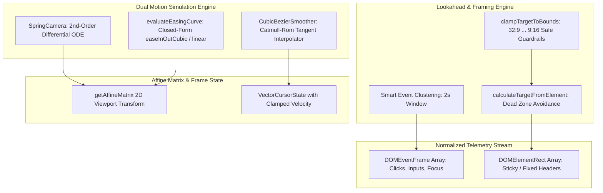

# FocalDOM Core Math & Physics Deep Investigation, Flaw Analysis & Improvement Plan 📐⚡

**Document Path:** `TODO/Improve_Core.md`  
**Parent Architecture:** [docs/README.md](../docs/README.md)  
**Audit Reference:** [TODO/AUDIT_REPORT.md](AUDIT_REPORT.md)  
**Suggested Implementation Branch:** `feat/core-engine-perfection`  
**Target Package:** `packages/core` (`@focaldom/core`)  
**Status:** 🚀 In Progress (Implementation Branch Active)  

---

## 📌 Executive Summary

A comprehensive, line-by-line mathematical and architectural audit of all source files in `packages/core/` (`spring-camera.ts`, `lookahead-buffer.ts`, `viewport-avoidance.ts`, `sticky-detector.ts`, `bezier-smoother.ts`, `ripple-math.ts`, and `validation.ts`) revealed opportunities to eliminate zoom-pumping artifacts through event clustering, add closed-form analytical easing curves alongside spring ODEs, protect extreme aspect ratios ($32:9 \dots 9:16$) against canvas overflow, and provide complete runtime project schema guards.

This document details all investigated flaws, classifies them by severity and root cause, and provides an actionable, finely divided multi-phase engineering remediation plan with granular checklists to elevate `packages/core` to a **10.0 / 10.0**.

---

## 🔍 Detailed Flaw & Vulnerability Audit Matrix

### 1. Camera Physics & Analytical Easing (`src/camera/`)

| ID | Severity | Category | File & Lines | Flaw / Vulnerability Description | Impact |
| :--- | :---: | :--- | :--- | :--- | :--- |
| **CR-01** | 🔴 **Major** | Missing Analytical Curves | `camera/` & `dom-event-schema.ts:45` | Schema declares `EasingCurve = 'spring' \| 'easeInOutCubic' \| 'linear'`, but the engine lacks an analytical closed-form easing module (`easing.ts`). | Non-spring easing curves cannot be evaluated with exact mathematical precision. |
| **CR-02** | 🟢 **Minor** | Zero Mass Guard | `spring-camera.ts:75-78` | Division by `this.mass` in acceleration computation lacks a lower boundary guard (`Math.max(0.01, mass)`). | Misconfigured zero/negative mass values trigger `NaN` velocity states. |

---

### 2. Lookahead Keyframe Generation & Clustering (`src/camera/lookahead-buffer.ts`)

| ID | Severity | Category | File & Lines | Flaw / Vulnerability Description | Impact |
| :--- | :---: | :--- | :--- | :--- | :--- |
| **CR-03** | 🟡 **Medium** | Zoom Pumping | `lookahead-buffer.ts:38-71` | Adjacent user clicks separated by $1.5\text{s}-2.0\text{s}$ create separate zoom in / zoom out cycles ("zoom pumping") rather than holding or smoothly panning. | Disorienting camera motion during rapid multi-field form fills. |
| **CR-04** | 🟢 **Minor** | Option Propagation | `lookahead-buffer.ts:64` | `easingCurve: 'spring'` is hardcoded on generated keyframes without honoring caller preferences. | Callers cannot generate auto-keyframes with analytical curves. |

---

### 3. Viewport Avoidance & Extreme Aspect Ratios (`src/avoidance/`)

| ID | Severity | Category | File & Lines | Flaw / Vulnerability Description | Impact |
| :--- | :---: | :--- | :--- | :--- | :--- |
| **CR-05** | 🟡 **Medium** | Aspect Ratio Overflow | `viewport-avoidance.ts:61-70` | Calculated target pan offsets ($x, y$) under ultra-wide ($32:9, 21:9$) or vertical ($9:16$) viewports can pan content edges beyond the canvas padding boundary. | Black border gaps appear on extreme monitor ratios. |
| **CR-06** | 🟡 **Medium** | Dead Zone Inversion | `sticky-detector.ts:16-52` | If top and bottom sticky regions occupy $>80\%$ of viewport height, `usableHeight` collapses, causing excessive zoom calculation. | Infinite / extreme zoom magnification on sites with huge fixed banners. |

---

### 4. Cursor Trajectory & Smoother (`src/cursor/`)

| ID | Severity | Category | File & Lines | Flaw / Vulnerability Description | Impact |
| :--- | :---: | :--- | :--- | :--- | :--- |
| **CR-07** | 🟢 **Minor** | Velocity Jitter | `bezier-smoother.ts:111-113` | Finite difference velocity estimation divides by raw microsecond duration without a lower threshold clamp ($16\text{ms}$). | Spurious high velocity estimates on identical sub-millisecond mouse timestamps. |

---

### 5. Schema Validation & Type Guards (`src/events/validation.ts`)

| ID | Severity | Category | File & Lines | Flaw / Vulnerability Description | Impact |
| :--- | :---: | :--- | :--- | :--- | :--- |
| **CR-08** | 🟡 **Medium** | Missing Type Guards | `validation.ts:33-72` | Contains validators for `DOMEventFrame` and `DOMElementRect`, but lacks `isValidCameraKeyframe` and `isValidFocalDOMProject`. | Malformed imported project files can bypass runtime validation. |

---

## 🏗️ Target Core Engine Architecture

---

## 🛠️ Granular Phase-Wise Implementation Checklist

### Phase 01: Multi-Curve Analytical Easing Module & Spring Stability (`src/camera/`)
- [ ] **Sub-phase 01.1: Closed-Form Analytical Easing Functions (`src/camera/easing.ts`)**
  - [ ] Implement `evaluateEasingCurve(curve: EasingCurve, t: number): number` handling `linear`, `easeInOutCubic`, and `spring` with input clamping $t \in [0, 1]$.
  - [ ] Implement state interpolation helper `interpolateCameraState(from: CameraState, to: CameraState, t: number, curve: EasingCurve): CameraState`.
  - [ ] Implement helper `evaluateEasingVelocity(curve: EasingCurve, t: number, durationSeconds: number): number` for analytical derivatives.
  - [ ] Export easing utilities from `src/camera/index.ts`.
- [ ] **Sub-phase 01.2: Numerical Stability & Mass Guard in `SpringCamera` (`src/camera/spring-camera.ts`)**
  - [ ] Enforce safe mass boundary `this.mass = Math.max(0.05, cfg.mass ?? 1.0)` to eliminate divide-by-zero risks.
  - [ ] Enforce safe positive boundaries for `stiffness` (`Math.max(1.0, cfg.stiffness)`) and `damping` (`Math.max(0.1, cfg.damping)`).
  - [ ] Add `NaN` and non-finite number guards in `step(deltaTimeSeconds)` and `setTarget(target)`.
- [ ] **Sub-phase 01.3: Easing & Spring Numerical Unit Tests (`tests/easing.test.ts`, `tests/spring-camera.test.ts`)**
  - [ ] Create `packages/core/tests/easing.test.ts` verifying boundary values ($t=0, t=1$), out-of-range inputs, and monotonicity.
  - [ ] Add tests in `packages/core/tests/spring-camera.test.ts` for zero/negative mass configurations and non-finite delta times.

---

### Phase 02: Smart Event Clustering & Lookahead Intelligence (`src/camera/lookahead-buffer.ts`)
- [ ] **Sub-phase 02.1: Temporal & Spatial Event Clustering Engine**
  - [ ] Add `clusterThresholdMs?: number` (default 2000ms) to `LookAheadOptions`.
  - [ ] Group consecutive interaction events (click, input, focus) that occur within `clusterThresholdMs` into cohesive clusters.
  - [ ] For clustered events, compute an encompassing bounding rect or progressive smooth transition instead of resetting camera to 1.0x (eliminates zoom pumping).
  - [ ] Ensure single isolated events maintain standard lookahead ease-in and hold duration.
- [ ] **Sub-phase 02.2: Configurable Easing Curve & Option Propagation**
  - [ ] Add `defaultEasingCurve?: EasingCurve` to `LookAheadOptions` (defaulting to `'spring'`).
  - [ ] Propagate caller-specified `easingCurve` to generated `CameraKeyframe` objects.
- [ ] **Sub-phase 02.3: Unit Tests for Event Clustering & Easing Options (`tests/lookahead-buffer.test.ts`)**
  - [ ] Test rapid successive clicks within 1500ms and verify keyframes merge or hold zoom without pumping.
  - [ ] Test custom easing curve option propagation in keyframe output.

---

### Phase 03: Safe Viewport, Extreme Aspect Ratio Clamping & Dead Zone Bounds (`src/avoidance/`)
- [ ] **Sub-phase 03.1: Aspect Ratio Clamping Guardrails (`src/avoidance/viewport-avoidance.ts`)**
  - [ ] Implement `clampTargetToBounds(target: CameraState, viewport: ViewportDimensions, marginPx?: number): CameraState`.
  - [ ] Prevent camera panning from exposing canvas margins beyond safe boundaries across extreme aspect ratios ($32:9$, $21:9$, $16:9$, $1:1$, $9:16$).
  - [ ] Integrate `clampTargetToBounds` into `calculateTargetFromElement`.
- [ ] **Sub-phase 03.2: Dead Zone Ceiling Cap & Collapse Protection (`src/avoidance/sticky-detector.ts`)**
  - [ ] Limit total sticky dead zone obstruction to maximum $65\%$ of viewport width and height (`maxObstructionRatio = 0.65`).
  - [ ] Prevent `usableWidth` and `usableHeight` from collapsing to near-zero when huge fixed headers/banners exist.
  - [ ] Ensure zoom calculation remains stable even with $90\%$ screen coverage of sticky elements.
- [ ] **Sub-phase 03.3: Unit Tests for Viewport Clamping & Extreme Ratios (`tests/sticky-avoidance.test.ts`)**
  - [ ] Test target calculation with $32:9$ ultrawide and $9:16$ vertical viewport configurations.
  - [ ] Test oversized sticky elements ($>80\%$ viewport) and verify zoom scale remains capped within safe limits.
  - [ ] Verify `clampTargetToBounds` edge clamping with varied zoom levels.

---

### Phase 04: Stable Finite-Difference Velocity in Bezier Smoother (`src/cursor/`)
- [ ] **Sub-phase 04.1: Velocity Estimation Clamping & Edge-Case Protection (`src/cursor/bezier-smoother.ts`)**
  - [ ] Add a minimum duration threshold of $16.6\text{ms}$ ($1/60\text{s}$) to finite difference velocity calculation to eliminate division spikes.
  - [ ] Guard against zero-duration or duplicate timestamp samples.
  - [ ] Ensure calculated velocity coordinates $(v_x, v_y)$ are always finite numbers.
- [ ] **Sub-phase 04.2: Unit Tests for Cursor Smoothing & Velocity Stability (`tests/bezier-smoother.test.ts`)**
  - [ ] Add tests for cursor points with identical timestamps ($0\text{ms}$ delta).
  - [ ] Add tests for sub-millisecond jitter timestamps and verify finite, smooth velocity outputs.

---

### Phase 05: Complete Schema Validation Suite & Type Guards (`src/events/validation.ts`)
- [ ] **Sub-phase 05.1: Implement Comprehensive Schema Type Guards**
  - [ ] Implement `isValidCameraKeyframe(kf: unknown): kf is CameraKeyframe` with scale bounds ($1.0 \dots 5.0$), valid IDs, positive durations, and valid `EasingCurve` types.
  - [ ] Implement `isValidSpringConfig(config: unknown): config is SpringConfig` ensuring positive finite numbers.
  - [ ] Implement `isValidFocalDOMProject(project: unknown): project is FocalDOMProject` performing complete recursive validation of all top-level project fields, nested objects, keyframes, and event arrays.
- [ ] **Sub-phase 05.2: Unit Tests for Schema Validators (`tests/events.test.ts`)**
  - [ ] Test `isValidCameraKeyframe` with valid, corrupt, and out-of-bound keyframes.
  - [ ] Test `isValidSpringConfig` with valid, empty, and invalid configs.
  - [ ] Test `isValidFocalDOMProject` with valid projects, missing required fields, and corrupt nested arrays.

---

### Phase 06: Package Integration, Clean Exports & Monorepo Verification
- [ ] **Sub-phase 06.1: Core Barrel Exports & Type Hygiene**
  - [ ] Update `src/camera/index.ts`, `src/avoidance/index.ts`, `src/cursor/index.ts`, `src/events/index.ts`, and `src/index.ts` to export all new functions, types, and constants.
  - [ ] Run `pnpm run build` / `tsc -b` to verify clean build without TypeScript errors.
- [ ] **Sub-phase 06.2: Full Monorepo Regression Testing**
  - [ ] Run all unit tests across all workspace packages (`pnpm test`).
  - [ ] Confirm 100% pass rate with zero regressions.

---

## ✅ Acceptance Criteria & Quality Checklist

1. **Analytical Easing Parity:** `evaluateEasingCurve('easeInOutCubic', t)` produces continuous, monotonic acceleration curves.
2. **Zero Zoom-Pumping:** Rapid sequential form clicks generate smooth, continuous panning without disorienting zoom retractions.
3. **Extreme Ratio Safe:** 32:9 ultra-wide and 9:16 vertical viewports maintain content bounds without background leakage.
4. **Complete Schema Protection:** `isValidFocalDOMProject` rejects corrupt or partially-formed JSON data safely.
5. **100% Test Coverage:** All new modules and edge cases have thorough unit tests passing in Vitest.
