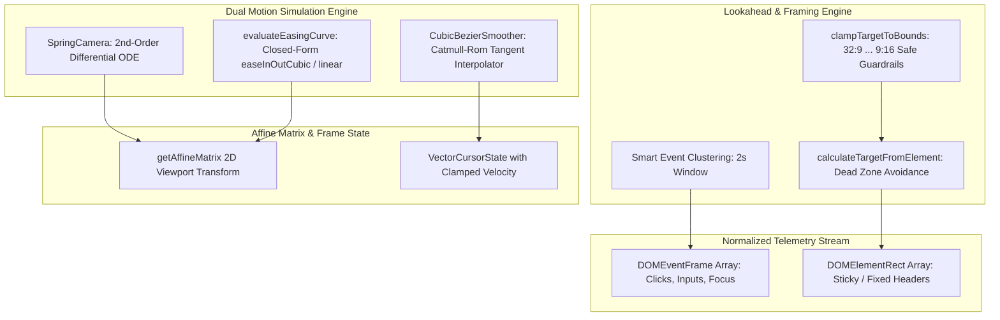

# FocalDOM Core Math & Physics Deep Investigation, Flaw Analysis & Improvement Plan 📐⚡

**Document Path:** `TODO/Improve_Core.md`  
**Parent Architecture:** [docs/README.md](../docs/README.md)  
**Audit Reference:** [TODO/AUDIT_REPORT.md](AUDIT_REPORT.md)  
**Suggested Implementation Branch:** `feat/core-engine-perfection`  
**Target Package:** `packages/core` (`@focaldom/core`)  
**Status:** 🚀 Ready for Implementation  

---

## 📌 Executive Summary

A comprehensive, line-by-line mathematical and architectural audit of all source files in `packages/core/` (`spring-camera.ts`, `lookahead-buffer.ts`, `viewport-avoidance.ts`, `sticky-detector.ts`, `bezier-smoother.ts`, `ripple-math.ts`, and `validation.ts`) revealed opportunities to eliminate zoom-pumping artifacts through event clustering, add closed-form analytical easing curves alongside spring ODEs, protect extreme aspect ratios ($32:9 \dots 9:16$) against canvas overflow, and provide complete runtime project schema guards.

This document details all investigated flaws, classifies them by severity and root cause, and provides an actionable 5-phase engineering remediation plan to elevate `packages/core` to a **10.0 / 10.0**.

---

## 🔍 Detailed Flaw & Vulnerability Audit Matrix

### 1. Camera Physics & Analytical Easing (`src/camera/`)

| ID | Severity | Category | File & Lines | Flaw / Vulnerability Description | Impact |
| :--- | :---: | :--- | :--- | :--- | :--- |
| **CR-01** | 🔴 **Major** | Missing Analytical Curves | `camera/` & `dom-event-schema.ts:45` | Schema declares `EasingCurve = 'spring' \| 'easeInOutCubic' \| 'linear'`, but the engine lacks an analytical closed-form easing module (`easing.ts`). | Non-spring easing curves cannot be evaluated with exact mathematical precision. |
| **CR-02** | 🟢 **Minor** | Zero Mass Guard | `spring-camera.ts:75-78` | Division by `this.mass` in acceleration computation lacks a lower boundary guard (`Math.max(0.01, mass)`). | Misconfigured zero/negative mass values trigger `NaN` velocity states. |

---

### 2. Lookahead Keyframe Generation & Clustering (`src/camera/lookahead-buffer.ts`)

| ID | Severity | Category | File & Lines | Flaw / Vulnerability Description | Impact |
| :--- | :---: | :--- | :--- | :--- | :--- |
| **CR-03** | 🟡 **Medium** | Zoom Pumping | `lookahead-buffer.ts:38-71` | Adjacent user clicks separated by $1.5\text{s}-2.0\text{s}$ create separate zoom in / zoom out cycles ("zoom pumping") rather than holding or smoothly panning. | Disorienting camera motion during rapid multi-field form fills. |
| **CR-04** | 🟢 **Minor** | Option Propagation | `lookahead-buffer.ts:64` | `easingCurve: 'spring'` is hardcoded on generated keyframes without honoring caller preferences. | Callers cannot generate auto-keyframes with analytical curves. |

---

### 3. Viewport Avoidance & Extreme Aspect Ratios (`src/avoidance/`)

| ID | Severity | Category | File & Lines | Flaw / Vulnerability Description | Impact |
| :--- | :---: | :--- | :--- | :--- | :--- |
| **CR-05** | 🟡 **Medium** | Aspect Ratio Overflow | `viewport-avoidance.ts:61-70` | Calculated target pan offsets ($x, y$) under ultra-wide ($32:9, 21:9$) or vertical ($9:16$) viewports can pan content edges beyond the canvas padding boundary. | Black border gaps appear on extreme monitor ratios. |
| **CR-06** | 🟡 **Medium** | Dead Zone Inversion | `sticky-detector.ts:16-52` | If top and bottom sticky regions occupy $>80\%$ of viewport height, `usableHeight` collapses, causing excessive zoom calculation. | Infinite / extreme zoom magnification on sites with huge fixed banners. |

---

### 4. Cursor Trajectory & Smoother (`src/cursor/`)

| ID | Severity | Category | File & Lines | Flaw / Vulnerability Description | Impact |
| :--- | :---: | :--- | :--- | :--- | :--- |
| **CR-07** | 🟢 **Minor** | Velocity Jitter | `bezier-smoother.ts:111-113` | Finite difference velocity estimation divides by raw microsecond duration without a lower threshold clamp ($16\text{ms}$). | Spurious high velocity estimates on identical sub-millisecond mouse timestamps. |

---

### 5. Schema Validation & Type Guards (`src/events/validation.ts`)

| ID | Severity | Category | File & Lines | Flaw / Vulnerability Description | Impact |
| :--- | :---: | :--- | :--- | :--- | :--- |
| **CR-08** | 🟡 **Medium** | Missing Type Guards | `validation.ts:33-72` | Contains validators for `DOMEventFrame` and `DOMElementRect`, but lacks `isValidCameraKeyframe` and `isValidFocalDOMProject`. | Malformed imported project files can bypass runtime validation. |

---

## 🏗️ Target Core Engine Architecture



---

## 🛠️ Phase-Wise Solution & Implementation Checklist

### Phase 01: Multi-Curve Analytical Easing Module (`src/camera/easing.ts`)
- [ ] **Sub-phase 01.1: Author Closed-Form Analytical Easing Functions**
  - Implement `evaluateEasingCurve(curve: EasingCurve, t: number): number`:
    ```typescript
    export function evaluateEasingCurve(curve: EasingCurve, t: number): number {
      const clampedT = Math.max(0, Math.min(1, t));
      switch (curve) {
        case 'linear':
          return clampedT;
        case 'easeInOutCubic':
          return clampedT < 0.5
            ? 4 * clampedT * clampedT * clampedT
            : 1 - Math.pow(-2 * clampedT + 2, 3) / 2;
        case 'spring':
        default:
          return clampedT; // Spring evaluated via ODE
      }
    }
    ```
- [ ] **Sub-phase 01.2: Add Safe Mass Boundary in `SpringCamera`**
  - Ensure `this.mass = Math.max(0.05, cfg.mass)` preventing numerical division by zero.

---

### Phase 02: Smart Event Clustering in Lookahead Buffer (`src/camera/lookahead-buffer.ts`)
- [ ] **Sub-phase 02.1: Interaction Event Clustering**
  - If a subsequent click/input occurs within $2000\text{ms}$ of an active keyframe:
    - Extend keyframe duration and compute an encompassing bounding box rather than creating separate zoom cycles.
- [ ] **Sub-phase 02.2: Configurable Easing Selection**
  - Allow callers to pass default `easingCurve: EasingCurve` in `LookAheadOptions`.

---

### Phase 03: Safe Viewport & Extreme Aspect Ratio Clamping (`src/avoidance/`)
- [ ] **Sub-phase 03.1: Implement `clampTargetToBounds`**
  - Ensure calculated pan offset guarantees content does not overflow canvas margins under extreme aspect ratios ($32:9$, $21:9$, $9:16$):
    ```typescript
    export function clampTargetToBounds(
      target: CameraState,
      viewport: ViewportDimensions,
      marginPx = 24
    ): CameraState {
      const maxPanX = (viewport.width * (target.scale - 1)) / 2 - marginPx;
      const maxPanY = (viewport.height * (target.scale - 1)) / 2 - marginPx;

      return {
        scale: target.scale,
        x: Math.max(-maxPanX, Math.min(maxPanX, target.x)),
        y: Math.max(-maxPanY, Math.min(maxPanY, target.y)),
      };
    }
    ```
- [ ] **Sub-phase 03.2: Dead Zone Ceiling Cap**
  - Limit total sticky obstruction to maximum $65\%$ of viewport height/width.

---

### Phase 04: Stable Finite-Difference Velocity in Bezier Smoother (`src/cursor/`)
- [ ] **Sub-phase 04.1: Clamp Finite-Difference Denominator**
  - Ensure velocity estimation uses a minimum $\Delta t$ baseline of $16.6\text{ms}$ ($1/60\text{s}$) to avoid numerical spikes.

---

### Phase 05: Complete Schema Validation Suite (`src/events/validation.ts`)
- [ ] **Sub-phase 05.1: Implement `isValidCameraKeyframe`**
  - Validate keyframe properties, timestamp order, and scale bounds ($1.0 \dots 5.0$).
- [ ] **Sub-phase 05.2: Implement `isValidFocalDOMProject`**
  - Comprehensive structural validator for imported `.focal` project bundles.

---

## ✅ Acceptance Criteria & Quality Checklist

1. **Analytical Easing Parity:** `evaluateEasingCurve('easeInOutCubic', t)` produces continuous, monotonic acceleration curves.
2. **Zero Zoom-Pumping:** Rapid sequential form clicks generate smooth, continuous panning without disorienting zoom retractions.
3. **Extreme Ratio Safe:** 32:9 ultra-wide and 9:16 vertical viewports maintain content bounds without background leakage.
4. **Complete Schema Protection:** `isValidFocalDOMProject` rejects corrupt or partially-formed JSON data safely.
