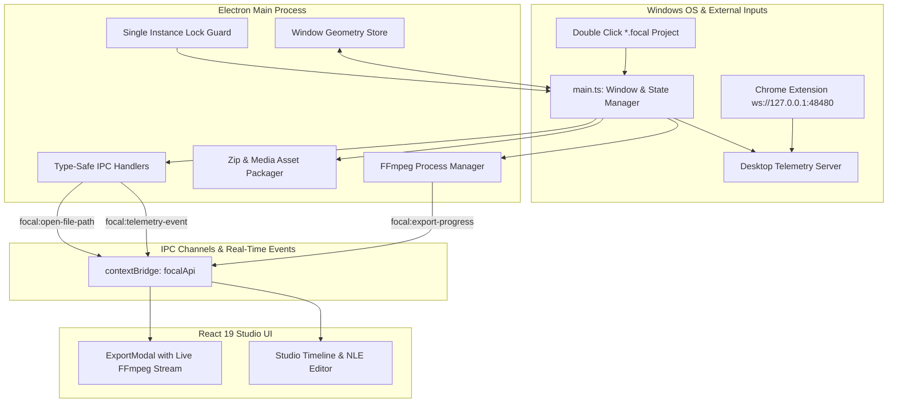

# FocalDOM Desktop App Deep Investigation, Flaw Analysis & Improvement Plan 🖥️🛡️

**Document Path:** `TODO/Improve_Desktop_App.md`  
**Parent Architecture:** [docs/README.md](../docs/README.md)  
**Audit Reference:** [TODO/AUDIT_REPORT.md](AUDIT_REPORT.md)  
**Suggested Implementation Branch:** `feat/desktop-app-perfection`  
**Target Package:** `apps/desktop` (`@focaldom/desktop`)  
**Status:** 🚀 In Progress (Implementation Branch Active)  

---

## 📌 Executive Summary

A comprehensive, line-by-line engineering audit of all source files in `apps/desktop/` (`main.ts`, `ffmpeg-manager.ts`, `file-manager.ts`, `ipc-handlers.ts`, `telemetry-server.ts`, `preload.ts`, `types.ts`, and `electron-builder.yml`) revealed critical architectural gaps, concurrency race conditions, lack of single-instance locking, missing live export progress feedback, and asset bundling oversights.

This document details all investigated flaws, classifies them by severity and root cause, and provides an actionable, finely divided multi-phase engineering remediation plan with granular checklists to elevate `apps/desktop` to a **10.0 / 10.0**.

---

## 🔍 Detailed Flaw & Vulnerability Audit Matrix

### 1. Main Process & Lifecycle (`src/main/main.ts`)

| ID | Severity | Category | File & Lines | Flaw / Vulnerability Description | Impact |
| :--- | :---: | :--- | :--- | :--- | :--- |
| **DT-01** | 🔴 **Major** | Concurrency Crash | `main.ts:14-35` | Lack of `app.requestSingleInstanceLock()`. Launching multiple instances causes duplicate WebSocket servers to attempt binding to port `48480` (`EADDRINUSE`). | Second instance crashes or fails to receive live telemetry from Chrome Extension. |
| **DT-02** | 🟡 **Medium** | UX & Ergonomics | `main.ts:16-19` | Window always opens with hardcoded dimensions (`1440x900`). Window position, size, and maximized state are lost on app restart. | Poor desktop UX; user must manually resize and position window on every launch. |
| **DT-03** | 🟡 **Medium** | OS Integration | `main.ts:40-50` | `process.argv` is not parsed for `.focal` project paths when opened via Windows Explorer or CLI. | Double-clicking `.focal` files opens a blank app instead of loading the project. |

---

### 2. IPC Communication & Streaming (`src/main/ipc-handlers.ts` & `src/preload/`)

| ID | Severity | Category | File & Lines | Flaw / Vulnerability Description | Impact |
| :--- | :---: | :--- | :--- | :--- | :--- |
| **DT-04** | 🔴 **Major** | Real-Time Feedback | `ipc-handlers.ts:48-66` | `focal:export-video` starts the streamer but does not pipe real-time FFmpeg progress (`fps`, `frame`, `percent`) to `mainWindow.webContents`. | Studio UI progress bar cannot show real-time encoding progress during long 4K renders. |
| **DT-05** | 🟡 **Medium** | Missing Preload API | `preload.ts` & `types.ts` | Missing `onExportProgress` and `showItemInFolder` methods in `window.focalApi`. | Renderer cannot listen to live export progress or reveal exported `.mp4` in Windows Explorer. |
| **DT-06** | 🟢 **Minor** | Listener Accumulation | `ipc-handlers.ts:80-84` | `telemetryServer.on('event-frame', ...)` registers listeners without teardown cleanup on window reload. | Potential event listener accumulation during development HMR. |

---

### 3. File System & Media Asset Packaging (`src/main/file-manager.ts`)

| ID | Severity | Category | File & Lines | Flaw / Vulnerability Description | Impact |
| :--- | :---: | :--- | :--- | :--- | :--- |
| **DT-07** | 🔴 **Major** | Asset Portability | `file-manager.ts:10-41` | `packProjectToFocalZip` bundles `project.json` and `events.json`, but omits the actual raw video/frame media file (`rawVideoPath`). | Sharing `.focal` project bundles across machines results in broken media references. |
| **DT-08** | 🟡 **Medium** | Error Handling | `file-manager.ts:71-100` | `promptOpenProject` throws unhandled JSON parse exceptions if a `.focal` file is corrupted, crashing the IPC call. | Crashes unhandled in UI instead of returning `{ project: null, error: string }`. |

---

### 4. Native Tooling & Packaging (`src/main/ffmpeg-manager.ts` & `electron-builder.yml`)

| ID | Severity | Category | File & Lines | Flaw / Vulnerability Description | Impact |
| :--- | :---: | :--- | :--- | :--- | :--- |
| **DT-09** | 🟡 **Medium** | Process Timeout | `ffmpeg-manager.ts:66-72` | `testSystemExecutable` has no timeout; hung anti-virus or locked processes can freeze binary resolution indefinitely. | Potential cold-startup hang. |
| **DT-10** | 🟡 **Medium** | Windows Association | `electron-builder.yml` | Missing `fileAssociations` configuration for `.focal` files. | Windows does not register `.focal` file icons or context menu associations. |

---

## 🏗️ Target Desktop Architecture

---

## 🛠️ Granular Phase-Wise Implementation Checklist

### Phase 01: Process Lifecycle & Single-Instance Safety (`src/main/main.ts`)
- [ ] **Sub-phase 01.1: Single-Instance Lock**
  - [ ] Implement `app.requestSingleInstanceLock()` to prevent duplicate desktop processes and port `48480` collision.
  - [ ] Focus existing window on `second-instance` and handle secondary CLI arguments.
- [ ] **Sub-phase 01.2: Window State & Geometry Persistence**
  - [ ] Save window bounds (`width`, `height`, `x`, `y`, `isMaximized`) to user data store.
  - [ ] Restore bounds on startup with screen display validation.
- [ ] **Sub-phase 01.3: CLI & File Open Argument Parsing**
  - [ ] Parse `.focal` project arguments on launch and forward to renderer via `focal:open-file-path`.

---

### Phase 02: Real-Time Export Progress IPC Channel (`src/main/ipc-handlers.ts` & `src/preload/`)
- [ ] **Sub-phase 02.1: Real-Time FFmpeg Progress Streaming**
  - [ ] Forward `onProgress` callbacks from `DesktopFFmpegManager.createStreamer` to renderer via `focal:export-progress`.
  - [ ] Add `focal:show-item-in-folder` handler using Electron `shell.showItemInFolder`.
- [ ] **Sub-phase 02.2: Preload Bridge Expansion (`src/preload/preload.ts` & `types.ts`)**
  - [ ] Expose `onExportProgress` subscription in `window.focalApi`.
  - [ ] Expose `showItemInFolder` in `window.focalApi`.
  - [ ] Expose `onOpenFilePath` listener in `window.focalApi`.

---

### Phase 03: Full-Fidelity Media Packaging in `.focal` Bundles (`src/main/file-manager.ts`)
- [ ] **Sub-phase 03.1: Embed Raw Video/Audio Media in Zip Archives**
  - [ ] Embed local raw video files into `media/` directory inside `.focal` zip bundle when packing.
  - [ ] Extract bundled media on unpacking and rehydrate `project.rawVideoPath`.
- [ ] **Sub-phase 03.2: Graceful Error Handling & Fallbacks**
  - [ ] Safe try/catch wrapping around zip decompression with user-friendly error objects.

---

### Phase 04: Native Tooling & Packaging (`src/main/ffmpeg-manager.ts` & `electron-builder.yml`)
- [ ] **Sub-phase 04.1: Add Process Timeout in FFmpeg Binary Detection**
  - [ ] Add 3000ms timeout to `testSystemExecutable` in `ffmpeg-manager.ts` to prevent startup hanging.
- [ ] **Sub-phase 04.2: Update `electron-builder.yml` & `package.json`**
  - [ ] Add Windows `.focal` file associations to `electron-builder.yml`.
  - [ ] Add `dist` and `dist:portable` build scripts to `package.json`.

---

### Phase 05: Unit & Integration Testing
- [ ] **Sub-phase 05.1: Expand `file-manager.test.ts`**
  - [ ] Test embedding and unpacking media files in `.focal` zip archives.
- [ ] **Sub-phase 05.2: Monorepo Verification**
  - [ ] Build `@focaldom/desktop` via `tsup`.
  - [ ] Run `pnpm test` across all monorepo packages with 100% pass rate.

---

## ✅ Acceptance Criteria & Quality Checklist

1. **Crash-Free Multi-Launch:** Launching multiple desktop instances focuses the active window without port collisions.
2. **Persistent Window State:** App launches with the exact window dimensions and position last used.
3. **Live 4K Export Monitoring:** Studio `ExportModal` reflects live frame-by-frame throughput directly from the FFmpeg child process.
4. **Self-Contained Projects:** `.focal` files can be transferred to any computer and opened with 100% video and telemetry fidelity.
5. **Robust FFmpeg Resolution:** Binary discovery is protected with timeouts and graceful fallbacks.
