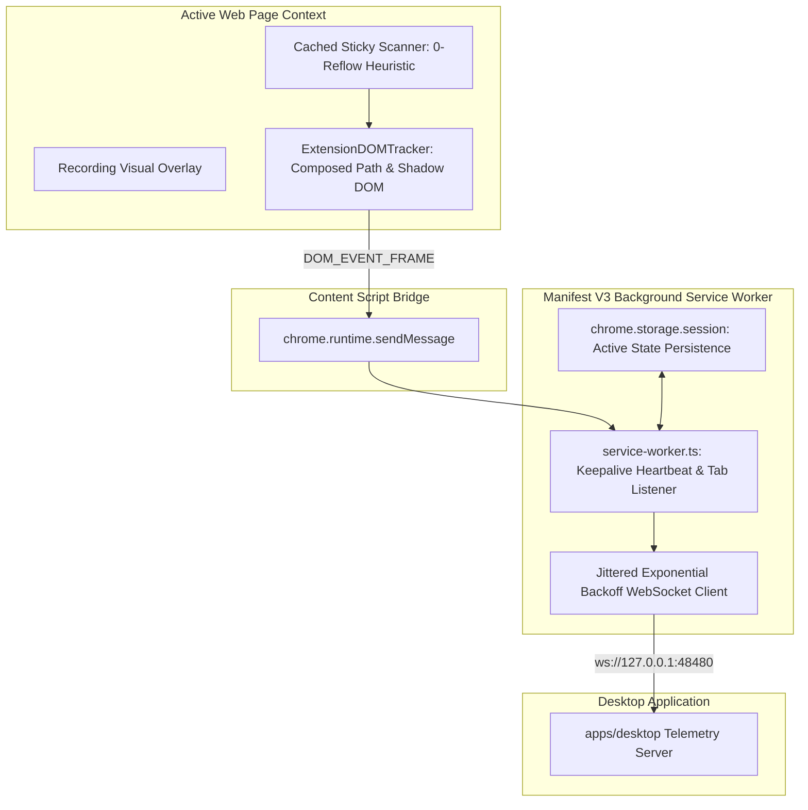

# FocalDOM Chrome Extension Deep Investigation, Flaw Analysis & Improvement Plan 🧩📡

**Document Path:** `TODO/Improve_Extension.md`  
**Parent Architecture:** [docs/README.md](../docs/README.md)  
**Audit Reference:** [TODO/AUDIT_REPORT.md](AUDIT_REPORT.md)  
**Suggested Implementation Branch:** `feat/extension-perfection`  
**Target Package:** `packages/extension` (`@focaldom/extension`)  
**Status:** 🚀 Ready for Implementation  

---

## 📌 Executive Summary

A comprehensive, line-by-line engineering audit of all source files in `packages/extension/` (`manifest.json`, `service-worker.ts`, `websocket-client.ts`, `content-script.ts`, `dom-tracker.ts`, `visual-overlay.ts`, and `popup.ts`) revealed critical Manifest V3 service worker lifecycle termination risks, brute-force layout thrashing during sticky header scans, linear WebSocket reconnection polling, lack of Shadow DOM traversal, and hardcoded port configurations.

This document details all investigated flaws, classifies them by severity and root cause, and provides an actionable 5-phase engineering remediation plan to elevate `packages/extension` to a **10.0 / 10.0**.

---

## 🔍 Detailed Flaw & Vulnerability Audit Matrix

### 1. Manifest V3 Service Worker Lifecycle (`src/background/service-worker.ts`)

| ID | Severity | Category | File & Lines | Flaw / Vulnerability Description | Impact |
| :--- | :---: | :--- | :--- | :--- | :--- |
| **EXT-01** | 🔴 **Major** | Worker Suspension | `service-worker.ts:4-7` | Manifest V3 service workers terminate after 30s of inactivity. `isRecording`, `activeRecordingTabId`, and `wsClient` reside strictly in RAM and are lost when the worker goes idle. | Telemetry stream halts mid-recording if no user clicks occur for 30 seconds. |
| **EXT-02** | 🟡 **Medium** | Navigation State Loss | `service-worker.ts:14-45` | If the user navigates to another page or reloads the tab, `chrome.tabs.onUpdated` is not listened to, so tracking is not re-established on the reloaded page. | Tracking silently stops on link clicks or form submissions that trigger page reloads. |

---

### 2. WebSocket Telemetry Client (`src/background/websocket-client.ts`)

| ID | Severity | Category | File & Lines | Flaw / Vulnerability Description | Impact |
| :--- | :---: | :--- | :--- | :--- | :--- |
| **EXT-03** | 🟡 **Medium** | Reconnect Hammering | `websocket-client.ts:96-101` | `scheduleReconnect` polls with a fixed 2s `setInterval` forever if the desktop app is closed. | Wastes CPU cycles and spams network logs when the user is not actively recording. |
| **EXT-04** | 🟡 **Medium** | Hardcoded Port | `websocket-client.ts:16-19` | Port `48480` is hardcoded with no UI option to customize the port from `popup.html` or storage. | Inability to connect if desktop app is configured to an alternate port. |

---

### 3. Content Script & DOM Tracker Performance (`src/content/dom-tracker.ts`)

| ID | Severity | Category | File & Lines | Flaw / Vulnerability Description | Impact |
| :--- | :---: | :--- | :--- | :--- | :--- |
| **EXT-05** | 🔴 **Major** | Layout Thrashing | `dom-tracker.ts:85-108` | `scanStickyRegions` executes `window.getComputedStyle(el)` on up to 500 elements on every scroll tick. | Causes severe CPU spikes and frame drops on heavy web apps (Notion, Figma, Linear). |
| **EXT-06** | 🟡 **Medium** | Shadow DOM Blindspot | `dom-tracker.ts:58-69` | `e.target` does not pierce Shadow DOM boundaries, so clicks inside Web Components return generic wrapper tags. | Auto-zoom camera cannot calculate precise inner button/input targets in web components. |

---

### 4. Extension Popup & Permissions (`src/popup/` & `manifest.json`)

| ID | Severity | Category | File & Lines | Flaw / Vulnerability Description | Impact |
| :--- | :---: | :--- | :--- | :--- | :--- |
| **EXT-07** | 🟢 **Minor** | Missing Settings UI | `popup.html` & `popup.ts` | No configuration menu to adjust desktop WebSocket port or toggle sticky header detection. | Reduced flexibility for power users and enterprise network environments. |

---

## 🏗️ Target Extension Architecture



---

## 🛠️ Phase-Wise Solution & Implementation Checklist

### Phase 01: Manifest V3 Service Worker Lifecycle & Keepalive (`src/background/service-worker.ts`)
- [ ] **Sub-phase 01.1: 15s Heartbeat Ping Keepalive**
  - Implement a periodic alarm / port keepalive preventing the service worker from sleeping during active recordings:
    ```typescript
    // 15s Keepalive ping to maintain worker activity during active recording
    let heartbeatInterval: any = null;

    function startHeartbeat() {
      if (heartbeatInterval) return;
      heartbeatInterval = setInterval(() => {
        chrome.runtime.getPlatformInfo(() => {
          // No-op API call keeping worker awake
        });
      }, 15000);
    }

    function stopHeartbeat() {
      if (heartbeatInterval) {
        clearInterval(heartbeatInterval);
        heartbeatInterval = null;
      }
    }
    ```
- [ ] **Sub-phase 01.2: Session Storage State Persistence**
  - Store `{ isRecording, activeRecordingTabId }` in `chrome.storage.session` on start/stop.
- [ ] **Sub-phase 01.3: Tab Navigation Auto-Reconnection**
  - Listen to `chrome.tabs.onUpdated`: if the active recording tab finishes loading (`status === 'complete'`), send `START_RECORDING` to re-arm the injected content script.

---

### Phase 02: Jittered Exponential Backoff & Configurable Ports (`src/background/websocket-client.ts`)
- [ ] **Sub-phase 02.1: Jittered Exponential Backoff Algorithm**
  - Implement dynamic reconnect delay:
    ```typescript
    private calculateReconnectDelay(): number {
      const baseDelay = 1000;
      const maxDelay = 30000;
      const exponential = Math.min(maxDelay, baseDelay * Math.pow(1.5, this.reconnectAttempts));
      const jitter = Math.random() * 500;
      return exponential + jitter;
    }
    ```
- [ ] **Sub-phase 02.2: Configurable Custom Port Storage**
  - Load `wsPort` from `chrome.storage.sync` (default `48480`) on startup.

---

### Phase 03: High-Performance DOM Tracker & Shadow DOM Ingestion (`src/content/dom-tracker.ts`)
- [ ] **Sub-phase 03.1: Composed Path Shadow DOM Target Extraction**
  - Use `e.composedPath()[0]` to extract the deepest targeted element across open shadow roots.
- [ ] **Sub-phase 03.2: Zero-Reflow Sticky Region Scanning**
  - Replace `document.querySelectorAll('*')` with targeted selectors (`header, nav, [class*="sticky"], [class*="fixed"], [style*="position"]`) and cache results for 500ms during active user scrolling.

---

### Phase 04: Popup Settings Drawer (`src/popup/`)
- [ ] **Sub-phase 04.1: Expandable Settings Menu in `popup.html`**
  - Add collapsible settings panel to change port (`48480`) and toggle visual overlay.
- [ ] **Sub-phase 04.2: Store Preferences in `chrome.storage.sync`**
  - Bind input fields in `popup.ts` to extension storage.

---

### Phase 05: Unit & Extension Testing Suite
- [ ] **Sub-phase 05.1: Test Exponential Backoff Timing**
  - Verify backoff scaling and reset upon successful connection in `websocket-client.test.ts`.
- [ ] **Sub-phase 05.2: Test Shadow Root Target Extraction**
  - Verify deep element metadata extraction in `dom-tracker.test.ts`.

---

## ✅ Acceptance Criteria & Quality Checklist

1. **Uninterrupted Recording:** Service worker remains active throughout multi-minute recordings without dropping WebSocket connections.
2. **Page Navigation Resilience:** Full-page reloads and link clicks maintain continuous recording seamlessly.
3. **Smooth 60fps Browsing:** Sticky header scans never cause layout thrashing on complex sites.
4. **Deep Component Awareness:** Clicks inside Shadow DOM elements capture precise element bounding rects.
5. **Configurable Port:** Users can set custom WebSocket ports via the popup UI.
