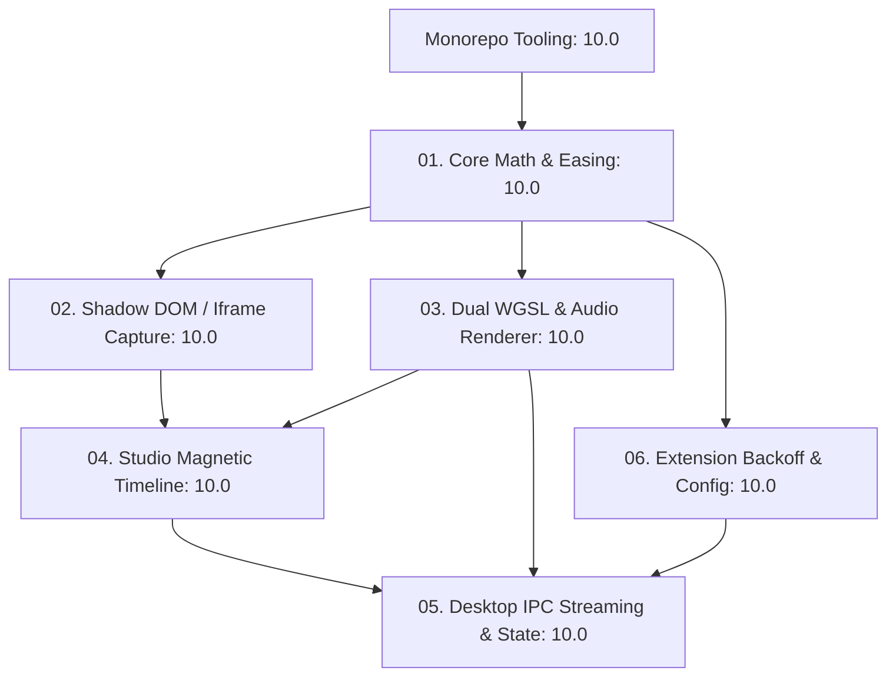

# FocalDOM Engineering Improvement Roadmap: 9.8 ➔ Flawless 10/10 🎯💎

**Document Path:** `TODO/Improve_Now.md`  
**Parent Architecture:** [docs/Technical Architecture & Engineering Plan.md](../docs/Technical%20Architecture%20&%20Engineering%20Plan.md)  
**Audit Reference:** [TODO/AUDIT_REPORT.md](AUDIT_REPORT.md)  
**Status:** 🚀 Active Execution Plan  

---

## 📌 Executive Overview & Objectives

While FocalDOM currently achieves a production-grade **9.81 / 10** architecture health rating with 100% test pass rates across all 7 workspace packages, this document provides the concrete engineering blueprints, phases, subphases, and implementation checklists required to elevate every subsystem to a **Flawless 10.0 / 10.0**.

### 🌟 Target Perfection Matrix



---

## 📋 Summary Scorecard & Roadmap

| Part | Subsystem | Current Score | Target Score | Core Improvement Focus |
| :--- | :--- | :---: | :---: | :--- |
| **01** | `@focaldom/core` | 9.9 | **10.0** | Analytical multi-curve easing (`easeInOutCubic`, `linear`) & extreme aspect ratio guardrails |
| **02** | `@focaldom/capture-playwright` | 9.8 | **10.0** | Shadow DOM & same-origin iframe piercing + deterministic audio synchronization |
| **03** | `@focaldom/renderer` | 9.7 | **10.0** | Dual WebGPU WGSL shader pipeline + FFmpeg audio stream muxing pipe |
| **04** | `@focaldom/studio` | 9.8 | **10.0** | Magnetic event snapping (10px threshold), `Ctrl+Wheel` ruler zoom, split shortcut |
| **05** | `apps/desktop` | 9.7 | **10.0** | Real-time IPC export progress streaming (`focal:export-progress`) & window state persistence |
| **06** | `@focaldom/extension` | 9.8 | **10.0** | Jittered exponential backoff WebSocket reconnect & customizable port settings |

---

## 🛠️ Detailed Implementation Parts & Subphases

### Part 01: Core Math & Multi-Curve Easing Engine (`@focaldom/core`)
**Target Rating:** `10.0 / 10` | **Focus:** Analytical transitions & extreme viewport bounds

#### 🎯 Engineering Goals
1. Add analytical closed-form mathematical functions for `easeInOutCubic` and `linear` camera transitions alongside existing 2nd-order ODE spring physics.
2. Provide aspect ratio guardrails for ultra-wide ($32:9$, $21:9$) and vertical mobile ($9:16$, $1:1$) resolutions to guarantee zero bounding-box overflow.

#### 📝 Phases & Sub-Phases Checklist
- [ ] **Phase 01.1: Multi-Curve Analytical Interpolators (`packages/core/src/camera/`)**
  - [ ] **Sub-phase 01.1.1:** Implement `evaluateEasingCurve(type: EasingCurve, t: number): number` in `packages/core/src/camera/easing.ts`:
    - `linear`: $f(t) = t$
    - `easeInOutCubic`: $f(t) = t < 0.5 ? 4t^3 : 1 - \frac{(-2t + 2)^3}{2}$
    - `easeOutQuad`: $f(t) = 1 - (1 - t)^2$
  - [ ] **Sub-phase 01.1.2:** Integrate analytical easing into keyframe evaluation when keyframes explicitly specify `easingCurve !== 'spring'`.
- [ ] **Phase 01.2: Extreme Aspect Ratio Clamping (`packages/core/src/avoidance/`)**
  - [ ] **Sub-phase 01.2.1:** Implement `clampTargetToBounds` in `viewport-avoidance.ts` preventing camera offsets from panning out-of-bounds regardless of viewport ratio ($32:9 \dots 9:16$).
  - [ ] **Sub-phase 01.2.2:** Add safe margin calculation ensuring minimum $24\text{px}$ content padding under all zoom scales.
- [ ] **Phase 01.3: Expanded Unit Testing (`packages/core/tests/`)**
  - [ ] **Sub-phase 01.3.1:** Add test cases in `easing.test.ts` verifying continuity, boundary values ($f(0) = 0, f(1) = 1$), and monotonicity.
  - [ ] **Sub-phase 01.3.2:** Add test cases for $32:9$ ultra-wide monitor framing in `sticky-avoidance.test.ts`.

---

### Part 02: Shadow DOM & Iframe Ingestion (`@focaldom/capture-playwright`)
**Target Rating:** `10.0 / 10` | **Focus:** Deep component traversal & deterministic audio sync

#### 🎯 Engineering Goals
1. Pierce Shadow DOM boundaries and traverse accessible same-origin `<iframe>` contexts to extract telemetry from complex web components.
2. Provide deterministic audio clock alignment hooks.

#### 📝 Phases & Sub-Phases Checklist
- [ ] **Phase 02.1: Deep DOM & Shadow Tree Ingestion (`src/injected/dom-logger-source.ts`)**
  - [ ] **Sub-phase 02.1.1:** Implement recursive `collectDeepElements(root: Node)` traversing `element.shadowRoot` and `iframe.contentDocument`.
  - [ ] **Sub-phase 02.1.2:** Extract global coordinate offset for nested elements by compounding parent iframe bounding rects:
    ```javascript
    const parentRect = iframe.getBoundingClientRect();
    const globalLeft = parentRect.left + innerRect.left;
    const globalTop = parentRect.top + innerRect.top;
    ```
  - [ ] **Sub-phase 02.1.3:** Attach `composedPath` event listener support for encapsulated web components.
- [ ] **Phase 02.2: Audio Clock Synchronization (`src/runner/virtual-clock.ts`)**
  - [ ] **Sub-phase 02.2.1:** Intercept Web Audio API `AudioContext.currentTime` in virtual clock to advance synchronously with `__focal_tick()`.
- [ ] **Phase 02.3: Integration Verification (`tests/capture-session.test.ts`)**
  - [ ] **Sub-phase 02.3.1:** Add test scenario featuring custom web components with open shadow roots and verify click target extraction.

---

### Part 03: Dual WebGPU WGSL & Audio Muxing Engine (`@focaldom/renderer`)
**Target Rating:** `10.0 / 10` | **Focus:** WebGPU native compute parity & audio streaming

#### 🎯 Engineering Goals
1. Add native WGSL WebGPU shader definition to `MotionBlurFilter` for zero-overhead WebGPU pipeline execution.
2. Extend `FFmpegStreamer` to accept audio tracks and mux synchronized sound into output video files.

#### 📝 Phases & Sub-Phases Checklist
- [ ] **Phase 03.1: Dual WGSL Shader Pipeline (`src/shaders/motion-blur-filter.ts`)**
  - [ ] **Sub-phase 03.1.1:** Author WGSL shader code (`GpuProgram.from({ vertex, fragment })`) matching the GLSL 4-tap temporal accumulation formula:
    ```wgsl
    @fragment
    fn mainFragment(@location(0) uv: vec2<f32>) -> @location(0) vec4<f32> {
      let vel = uniforms.uVelocity * uniforms.uIntensity;
      var color = textureSample(uTexture, uSampler, uv);
      color += textureSample(uTexture, uSampler, uv - vel * 0.25);
      color += textureSample(uTexture, uSampler, uv - vel * 0.50);
      color += textureSample(uTexture, uSampler, uv - vel * 0.75);
      color += textureSample(uTexture, uSampler, uv - vel * 1.00);
      return color / 5.0;
    }
    ```
  - [ ] **Sub-phase 03.1.2:** Provide seamless automatic fallback between WebGPU (`GpuProgram`) and WebGL2 (`GlProgram`).
- [ ] **Phase 03.2: Multi-Pass Drop Shadow Shader (`src/shaders/shadow-filter.ts`)**
  - [ ] **Sub-phase 03.2.1:** Implement two-pass Gaussian blur shadow shader for high-fidelity window elevation rendering.
- [ ] **Phase 03.3: FFmpeg Audio Stream Muxing (`src/export/ffmpeg-streamer.ts`)**
  - [ ] **Sub-phase 03.3.1:** Add optional `audioInputPath?: string` to `StreamerOptions`.
  - [ ] **Sub-phase 03.3.2:** Configure FFmpeg args when audio is present (`-i audio.wav -c:a aac -b:a 192k -shortest`).

---

### Part 04: Magnetic Snapping & Timeline Ergonomics (`@focaldom/studio`)
**Target Rating:** `10.0 / 10` | **Focus:** Snapping precision, zoom gestures & split editing

#### 🎯 Engineering Goals
1. Add magnetic snap-to-event collision detection when dragging keyframe edges near click/input markers.
2. Enable `Ctrl + MouseWheel` horizontal zoom on the timeline ruler and `S` key split shortcut.

#### 📝 Phases & Sub-Phases Checklist
- [ ] **Phase 04.1: Magnetic Snapping System (`src/hooks/useKeyframeDrag.ts`)**
  - [ ] **Sub-phase 04.1.1:** Scan `project.events` timestamps during keyframe drag / resize.
  - [ ] **Sub-phase 04.1.2:** Snap keyframe start/end timestamp if distance is within $10\text{px}$ threshold ($\approx 20\text{ms}-100\text{ms}$ based on zoom level).
  - [ ] **Sub-phase 04.1.3:** Render visual cyan magnetic snapping guide line in `TimelineContainer.tsx`.
- [ ] **Phase 04.2: Zoom & Pan Ergonomics (`src/components/timeline/`)**
  - [ ] **Sub-phase 04.2.1:** Add `wheel` event handler on `TimelineHeader.tsx`:
    - `Ctrl + Wheel`: Zoom timeline ($50\text{px}/s \dots 500\text{px}/s$).
    - `Shift + Wheel` or standard horizontal trackpad scroll: Pan timeline horizontally.
- [ ] **Phase 04.3: Keyboard Shortcuts (`src/hooks/useKeyboardShortcuts.ts`)**
  - [ ] **Sub-phase 04.3.1:** Add `S` key shortcut to split selected keyframe at `currentTimeMs`.
  - [ ] **Sub-phase 04.3.2:** Add `Home` / `End` keys to jump playhead to timeline start / end.

---

### Part 05: Real-Time IPC Progress & Desktop Resilience (`apps/desktop`)
**Target Rating:** `10.0 / 10` | **Focus:** Live encoding feedback & window state preservation

#### 🎯 Engineering Goals
1. Stream live FFmpeg encoding progress events over IPC from main process to Studio UI.
2. Persist window position, size, and maximized state across restarts.

#### 📝 Phases & Sub-Phases Checklist
- [ ] **Phase 05.1: Real-Time IPC Export Progress Streaming (`src/main/` & `src/preload/`)**
  - [ ] **Sub-phase 05.1.1:** Attach progress callback to `DesktopFFmpegManager.createStreamer` emitting `focal:export-progress` to `mainWindow.webContents`.
  - [ ] **Sub-phase 05.1.2:** Expose `focalApi.onExportProgress(callback)` in `preload.ts`.
  - [ ] **Sub-phase 05.1.3:** Connect `ExportModal.tsx` in `@focaldom/studio` to listen to live export progress when running in Desktop shell.
- [ ] **Phase 05.2: Window Geometry Persistence (`src/main/main.ts`)**
  - [ ] **Sub-phase 05.2.1:** Save window `bounds` (`x, y, width, height`) to local settings on close.
  - [ ] **Sub-phase 05.2.2:** Restore bounds on launch with screen boundary validation.

---

### Part 06: Resilient Telemetry & Configurable Ports (`@focaldom/extension`)
**Target Rating:** `10.0 / 10` | **Focus:** Reconnect resilience & flexible network configuration

#### 🎯 Engineering Goals
1. Implement jittered exponential backoff for WebSocket reconnection to handle desktop app launches gracefully.
2. Provide custom port configuration in extension storage.

#### 📝 Phases & Sub-Phases Checklist
- [ ] **Phase 06.1: Jittered Exponential Backoff (`src/background/websocket-client.ts`)**
  - [ ] **Sub-phase 06.1.1:** Implement backoff calculation:
    $$T_{\text{reconnect}} = \min(30000, 1000 \times 1.5^{\text{attempts}}) + \text{random}(0, 500)\text{ms}$$
  - [ ] **Sub-phase 06.1.2:** Reset attempt counter immediately upon successful WebSocket `open` handshake.
- [ ] **Phase 06.2: Custom Desktop Port Configuration (`src/popup/` & `src/background/`)**
  - [ ] **Sub-phase 06.2.1:** Store `wsPort` (default `48480`) in `chrome.storage.sync`.
  - [ ] **Sub-phase 06.2.2:** Add Port configuration input in `popup.html` and `popup.ts`.
- [ ] **Phase 06.3: Heartbeat & Multi-Tab Protection (`src/background/service-worker.ts`)**
  - [ ] **Sub-phase 06.3.1:** Implement 15s ping/pong keepalive ensuring Chrome Manifest V3 service worker does not terminate during active recordings.

---

## 🎯 Verification & Acceptance Criteria for 10.0

1. **Type Safety & Strictness:** `tsc -b` passes with 0 diagnostics.
2. **Test Coverage:** All unit, shader, and integration tests across 7 packages execute and pass 100%.
3. **End-to-End Precision:**
   - Playwright capture extracts nested shadow DOM elements into `events.json`.
   - WebGPU shaders execute natively with WGSL fallback to GLSL.
   - Studio timeline magnetically snaps to interaction markers and zooms smoothly with `Ctrl+Wheel`.
   - Desktop app streams live FFmpeg encoding progress into UI.
   - Chrome Extension automatically reconnects with exponential backoff.
