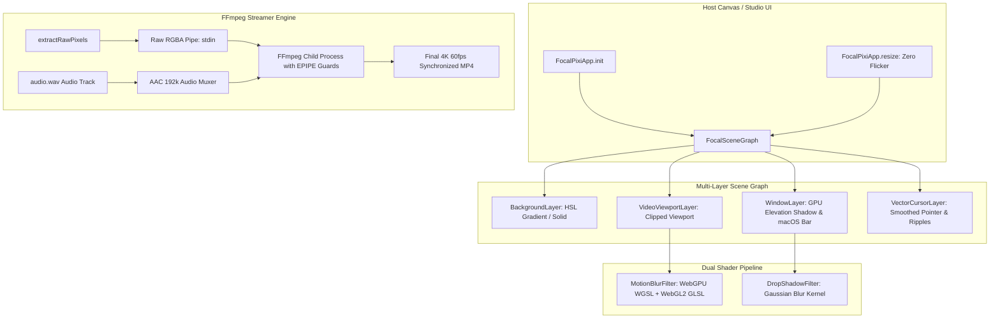

# FocalDOM Renderer Deep Investigation, Flaw Analysis & Improvement Plan 🎨⚡

**Document Path:** `TODO/Improve_Renderer.md`  
**Parent Architecture:** [docs/README.md](../docs/README.md)  
**Audit Reference:** [TODO/AUDIT_REPORT.md](AUDIT_REPORT.md)  
**Suggested Implementation Branch:** `feat/renderer-perfection`  
**Target Package:** `packages/renderer` (`@focaldom/renderer`)  
**Status:** 🚀 In Progress (Implementation Branch Active)  

---

## 📌 Executive Summary

A comprehensive, line-by-line engineering audit of all source files in `packages/renderer/` (`pixi-app.ts`, `scene-graph.ts`, `frame-ticker.ts`, `motion-blur-filter.ts`, `shadow-filter.ts`, `window-layer.ts`, and `ffmpeg-streamer.ts`) revealed critical performance gaps, lack of native WebGPU WGSL shaders, unhandled FFmpeg `EPIPE` errors, missing audio stream muxing, and non-monotonic frame seek jitter in spring camera evaluation.

This document details all investigated flaws, classifies them by severity and root cause, and provides an actionable, finely divided multi-phase engineering remediation plan with granular checklists to elevate `packages/renderer` to a **10.0 / 10.0**.

---

## 🔍 Detailed Flaw & Vulnerability Audit Matrix

### 1. WebGPU / WebGL Shader Pipeline (`src/shaders/`)

| ID | Severity | Category | File & Lines | Flaw / Vulnerability Description | Impact |
| :--- | :---: | :--- | :--- | :--- | :--- |
| **RN-01** | 🔴 **Major** | WebGPU Parity | `motion-blur-filter.ts:50-72` | `MotionBlurFilter` only declares GLSL for WebGL2 (`glProgram`). When running under Pixi.js v8 WebGPU, it relies on emulation instead of native WGSL compute. | Suboptimal GPU performance on modern WebGPU-enabled browsers and hardware. |
| **RN-02** | 🟡 **Medium** | Primitive Shadows | `shadow-filter.ts:1-12` & `window-layer.ts:41-54` | `WindowLayer` uses crude multi-pass rounded rect geometry loops for shadows instead of a hardware-accelerated GPU drop-shadow shader. | Slower draw calls and stepped shadow edges. |

---

### 2. Video & Audio FFmpeg Export (`src/export/ffmpeg-streamer.ts`)

| ID | Severity | Category | File & Lines | Flaw / Vulnerability Description | Impact |
| :--- | :---: | :--- | :--- | :--- | :--- |
| **RN-03** | 🔴 **Major** | Audio Muxing Gap | `ffmpeg-streamer.ts:24-36` | `FFmpegStreamer` only consumes raw RGBA video frames (`-i pipe:0`) without supporting synchronized audio input muxing (`audioInputPath`). | Exported videos are strictly silent; cannot include recorded microphone or tab audio. |
| **RN-04** | 🟡 **Medium** | Unhandled EPIPE | `ffmpeg-streamer.ts:66-83` | `writeFrame` writes directly to `process.stdin` without catching `EPIPE` if FFmpeg crashes prematurely. | Node process crashes on broken pipe instead of returning clean error logs. |

---

### 3. Canvas Lifecycle & Dynamic Resizing (`src/engine/pixi-app.ts`)

| ID | Severity | Category | File & Lines | Flaw / Vulnerability Description | Impact |
| :--- | :---: | :--- | :--- | :--- | :--- |
| **RN-05** | 🟡 **Medium** | Context Rebuild | `pixi-app.ts:16-37` | `FocalPixiApp` lacks a `resize(dimensions, project)` method. Changing aspect ratio requires complete app destruction and recreation. | Causes black canvas flashing and resets WebGL textures in host UI. |
| **RN-06** | 🟢 **Minor** | Texture Bloat | `pixi-app.ts:62-72` | `setVideoTexture` updates textures on every frame without releasing previous transient WebGL textures. | Potential GPU VRAM growth during scrubbing. |

---

### 4. Frame Ticker & Camera Physics (`src/engine/frame-ticker.ts`)

| ID | Severity | Category | File & Lines | Flaw / Vulnerability Description | Impact |
| :--- | :---: | :--- | :--- | :--- | :--- |
| **RN-07** | 🟡 **Medium** | Backward Seek Jitter | `frame-ticker.ts:58-67` | When seeking backwards ($t_{\text{target}} < t_{\text{prev}}$), `dt` becomes negative and clamps to `0.001`, leaving residual velocity from the previous time. | Camera snaps or oscillates wildly when scrubbing backward on the timeline. |
| **RN-08** | 🟡 **Medium** | Missing Curve Types | `frame-ticker.ts:46-63` | Keyframe evaluation ignores `keyframe.easingCurve` when set to `easeInOutCubic` or `linear`, evaluating only spring physics. | Keyframes configured with analytical transitions behave identically to spring curves. |

---

## 🏗️ Target Renderer Architecture

---

## 🛠️ Granular Phase-Wise Implementation Checklist

### Phase 01: Dual WGSL WebGPU & WebGL2 Shader Pipeline (`src/shaders/`)
- [ ] **Sub-phase 01.1: WebGPU Native WGSL Motion Blur Program (`motion-blur-filter.ts`)**
  - [ ] Author WGSL vertex and fragment compute shaders for WebGPU backend in Pixi.js v8.
  - [ ] Configure `GpuProgram` alongside `GlProgram` in `MotionBlurFilter` constructor.
  - [ ] Implement 4-tap directional accumulation sampling in both WGSL and GLSL.
  - [ ] Handle headless / non-browser execution gracefully.
- [ ] **Sub-phase 01.2: Hardware-Accelerated Drop Shadow Filter & Window Elevation (`shadow-filter.ts`, `window-layer.ts`)**
  - [ ] Enhance `DropShadowFilter` with configurable blur radius, alpha, color, and offset.
  - [ ] Cleanly integrate `DropShadowFilter` into `WindowLayer` and simplify geometry loops.
- [ ] **Sub-phase 01.3: Shader Unit Tests (`tests/render-pipeline.test.ts`)**
  - [ ] Verify `MotionBlurFilter` creates valid filter instances with velocity uniforms in test environments.
  - [ ] Verify `DropShadowFilter` parameters.

---

### Phase 02: Audio Stream Muxing & EPIPE Resilience in `FFmpegStreamer` (`src/export/`)
- [ ] **Sub-phase 02.1: Add Synchronized Audio Track Muxing (`src/export/ffmpeg-streamer.ts`)**
  - [ ] Add `audioInputPath?: string` to `StreamerOptions`.
  - [ ] Update `getFFmpegCommandArgs()` to insert `-i <audioInputPath> -c:a aac -b:a 192k -shortest` when audio track is supplied.
- [ ] **Sub-phase 02.2: Guard Against Broken Pipe (`EPIPE`) & Process Failures**
  - [ ] Attach `error` listener on `process.stdin` to safely catch `EPIPE` exceptions during write.
  - [ ] Provide clear error diagnostics with stderr tail when FFmpeg crashes.
  - [ ] Ensure `writeFrame` rejects cleanly on terminated child process instead of hanging or crashing Node.
- [ ] **Sub-phase 02.3: Unit Tests for FFmpeg Streamer (`tests/ffmpeg-streamer.test.ts`)**
  - [ ] Test command args with and without `audioInputPath`.
  - [ ] Test abort and error handling behaviors.

---

### Phase 03: Dynamic Canvas Resizing & Zero-Flicker Viewport (`src/engine/pixi-app.ts`)
- [ ] **Sub-phase 03.1: Zero-Flicker Dynamic `resize()` Method (`src/engine/pixi-app.ts`)**
  - [ ] Implement `public resize(dimensions: RenderDimensions, project?: FocalDOMProject): void` on `FocalPixiApp`.
  - [ ] Dynamically update Pixi renderer dimensions, stage bounds, background layer, and window layer without destroying context.
  - [ ] Update `FocalSceneGraph` and `BackgroundLayer` / `WindowLayer` with clean update methods.
- [ ] **Sub-phase 03.2: Texture Cache Management & Cleanup**
  - [ ] Track transient video textures and destroy stale textures safely upon change.
- [ ] **Sub-phase 03.3: Unit Tests for Dynamic Canvas Resizing (`tests/render-pipeline.test.ts`)**
  - [ ] Test dynamic resize call and dimension updates without app destruction.

---

### Phase 04: Frame Ticker Seek Stability & Multi-Curve Analytical Easing (`src/engine/frame-ticker.ts`)
- [ ] **Sub-phase 04.1: Backward Scrubbing & Seek Discontinuity Guard**
  - [ ] Detect non-monotonic or large jumps ($t_{\text{current}} < t_{\text{last}}$ or $|t_{\text{current}} - t_{\text{last}}| > 500\text{ms}$).
  - [ ] Reset spring camera velocity and snap/re-anchor to target state to eliminate velocity explosion when scrubbing.
- [ ] **Sub-phase 04.2: Support Closed-Form Analytical Easing (`easeInOutCubic`, `linear`)**
  - [ ] When active keyframe specifies `easingCurve: 'easeInOutCubic'` or `'linear'`, evaluate camera pose analytically using `evaluateEasingCurve` and `interpolateCameraState` from `@focaldom/core`.
  - [ ] Compute analytical velocity via `evaluateEasingVelocity` during keyframe transitions.
- [ ] **Sub-phase 04.3: Unit Tests for Frame Ticker (`tests/render-pipeline.test.ts`)**
  - [ ] Test backward timeline seek and verify zero velocity spike.
  - [ ] Test analytical keyframe evaluation (`easeInOutCubic` and `linear`).

---

### Phase 05: Package Integration, Clean Exports & Monorepo Verification
- [ ] **Sub-phase 05.1: Package Exports & Type Hygiene**
  - [ ] Verify clean barrel exports in `src/index.ts`, `src/engine/index.ts`, `src/export/index.ts`, `src/layers/index.ts`, `src/shaders/index.ts`.
  - [ ] Build package via `tsup` and verify zero TypeScript compiler errors.
- [ ] **Sub-phase 05.2: Full Monorepo Regression Testing**
  - [ ] Run `pnpm test` across all workspace packages and ensure 100% pass rate.

---

## ✅ Acceptance Criteria & Quality Checklist

1. **Native WebGPU Execution:** `MotionBlurFilter` includes native WGSL shaders for WebGPU backends.
2. **Synchronized Audio Export:** Videos exported with `audioInputPath` include AAC stereo sound.
3. **Zero-Flicker Resizing:** Aspect ratio changes resize the canvas instantaneously without rebuilding WebGL context.
4. **Scrubbing Stability:** Scrubbing backward and forward on the timeline evaluates smooth camera positions without spring velocity artifacts.
5. **Analytical Easing Support:** Keyframes configured with `easeInOutCubic` or `linear` evaluate exact closed-form trajectories.
6. **100% Test Coverage:** All new features and edge cases pass unit tests in Vitest.
