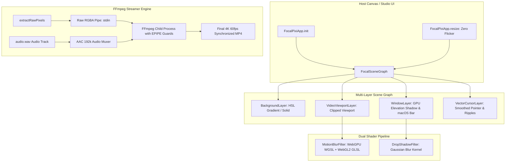

# FocalDOM Renderer Deep Investigation, Flaw Analysis & Improvement Plan 🎨⚡

**Document Path:** `TODO/Improve_Renderer.md`  
**Parent Plan:** [docs/Technical Architecture & Engineering Plan.md](../docs/Technical%20Architecture%20&%20Engineering%20Plan.md)  
**Audit Reference:** [TODO/AUDIT_REPORT.md](AUDIT_REPORT.md)  
**Suggested Implementation Branch:** `feat/renderer-perfection`  
**Target Package:** `packages/renderer` (`@focaldom/renderer`)  
**Status:** 🚀 Ready for Implementation  

---

## 📌 Executive Summary

A comprehensive, line-by-line engineering audit of all source files in `packages/renderer/` (`pixi-app.ts`, `scene-graph.ts`, `frame-ticker.ts`, `motion-blur-filter.ts`, `shadow-filter.ts`, `window-layer.ts`, and `ffmpeg-streamer.ts`) revealed critical performance gaps, lack of native WebGPU WGSL shaders, unhandled FFmpeg `EPIPE` errors, missing audio stream muxing, and non-monotonic frame seek jitter in spring camera evaluation.

This document details all investigated flaws, classifies them by severity and root cause, and provides an actionable 5-phase engineering remediation plan to elevate `packages/renderer` to a **10.0 / 10.0**.

---

## 🔍 Detailed Flaw & Vulnerability Audit Matrix

### 1. WebGPU / WebGL Shader Pipeline (`src/shaders/`)

| ID | Severity | Category | File & Lines | Flaw / Vulnerability Description | Impact |
| :--- | :---: | :--- | :--- | :--- | :--- |
| **RN-01** | 🔴 **Major** | WebGPU Parity | `motion-blur-filter.ts:50-72` | `MotionBlurFilter` only declares GLSL for WebGL2 (`glProgram`). When running under Pixi.js v8 WebGPU, it relies on emulation instead of native WGSL compute. | Suboptimal GPU performance on modern WebGPU-enabled browsers and hardware. |
| **RN-02** | 🟡 **Medium** | Primitive Shadows | `shadow-filter.ts:1-12` & `window-layer.ts:41-54` | `WindowLayer` uses crude multi-pass rounded rect geometry loops for shadows instead of a hardware-accelerated GPU drop-shadow shader. | Slower draw calls and stepped shadow edges. |

---

### 2. Video & Audio FFmpeg Export (`src/export/ffmpeg-streamer.ts`)

| ID | Severity | Category | File & Lines | Flaw / Vulnerability Description | Impact |
| :--- | :---: | :--- | :--- | :--- | :--- |
| **RN-03** | 🔴 **Major** | Audio Muxing Gap | `ffmpeg-streamer.ts:24-36` | `FFmpegStreamer` only consumes raw RGBA video frames (`-i pipe:0`) without supporting synchronized audio input muxing (`audioInputPath`). | Exported videos are strictly silent; cannot include recorded microphone or tab audio. |
| **RN-04** | 🟡 **Medium** | Unhandled EPIPE | `ffmpeg-streamer.ts:66-83` | `writeFrame` writes directly to `process.stdin` without catching `EPIPE` if FFmpeg crashes prematurely. | Node process crashes on broken pipe instead of returning clean error logs. |

---

### 3. Canvas Lifecycle & Dynamic Resizing (`src/engine/pixi-app.ts`)

| ID | Severity | Category | File & Lines | Flaw / Vulnerability Description | Impact |
| :--- | :---: | :--- | :--- | :--- | :--- |
| **RN-05** | 🟡 **Medium** | Context Rebuild | `pixi-app.ts:16-37` | `FocalPixiApp` lacks a `resize(dimensions, project)` method. Changing aspect ratio requires complete app destruction and recreation. | Causes black canvas flashing and resets WebGL textures in host UI. |
| **RN-06** | 🟢 **Minor** | Texture Bloat | `pixi-app.ts:62-72` | `setVideoTexture` updates textures on every frame without releasing previous transient WebGL textures. | Potential GPU VRAM growth during scrubbing. |

---

### 4. Frame Ticker & Camera Physics (`src/engine/frame-ticker.ts`)

| ID | Severity | Category | File & Lines | Flaw / Vulnerability Description | Impact |
| :--- | :---: | :--- | :--- | :--- | :--- |
| **RN-07** | 🟡 **Medium** | Backward Seek Jitter | `frame-ticker.ts:58-67` | When seeking backwards ($t_{\text{target}} < t_{\text{prev}}$), `dt` becomes negative and clamps to `0.001`, leaving residual velocity from the previous time. | Camera snaps or oscillates wildly when scrubbing backward on the timeline. |
| **RN-08** | 🟡 **Medium** | Missing Curve Types | `frame-ticker.ts:46-63` | Keyframe evaluation ignores `keyframe.easingCurve` when set to `easeInOutCubic` or `linear`, evaluating only spring physics. | Keyframes configured with analytical transitions behave identically to spring curves. |

---

## 🏗️ Target Renderer Architecture



---

## 🛠️ Phase-Wise Solution & Implementation Checklist

### Phase 01: Dual WGSL WebGPU Shader Pipeline (`src/shaders/`)
- [ ] **Sub-phase 01.1: Author Native WGSL Motion Blur Program**
  - Implement dual `GpuProgram` (WGSL) and `GlProgram` (GLSL) in `MotionBlurFilter`:
    ```wgsl
    // WGSL WebGPU 4-tap motion blur
    @fragment
    fn mainFragment(
      @location(0) uv: vec2<f32>,
      @builtin(position) position: vec4<f32>
    ) -> @location(0) vec4<f32> {
      let vel = uniforms.uVelocity * uniforms.uIntensity;
      var color = textureSample(uTexture, uSampler, uv);
      color += textureSample(uTexture, uSampler, uv - vel * 0.25);
      color += textureSample(uTexture, uSampler, uv - vel * 0.50);
      color += textureSample(uTexture, uSampler, uv - vel * 0.75);
      color += textureSample(uTexture, uSampler, uv - vel * 1.00);
      return color / 5.0;
    }
    ```
- [ ] **Sub-phase 01.2: Hardware-Accelerated Drop Shadow Shader**
  - Implement separable 2-pass Gaussian blur filter for smooth window elevation.

---

### Phase 02: Audio Stream Muxing & EPIPE Resilience in `FFmpegStreamer` (`src/export/`)
- [ ] **Sub-phase 02.1: Add Synchronized Audio Track Muxing**
  - Update `StreamerOptions` to accept `audioInputPath?: string`:
    ```typescript
    public getFFmpegCommandArgs(): string[] {
      const { preset, outputPath, audioInputPath } = this.options;
      const args = [
        '-y',
        '-f', 'rawvideo',
        '-pix_fmt', 'rgba',
        '-s', `${preset.width}x${preset.height}`,
        '-r', `${preset.fps}`,
        '-i', 'pipe:0',
      ];

      if (audioInputPath) {
        args.push('-i', audioInputPath, '-c:a', 'aac', '-b:a', '192k', '-shortest');
      }

      args.push(...preset.ffmpegArgs, outputPath);
      return args;
    }
    ```
- [ ] **Sub-phase 02.2: Guard Against Broken Pipe (`EPIPE`) Errors**
  - Catch stream error events on `process.stdin` and reject cleanly.

---

### Phase 03: Dynamic Canvas Resizing & Zero-Flicker Viewport (`src/engine/pixi-app.ts`)
- [ ] **Sub-phase 03.1: Implement Dynamic `resize()` Method**
  - Add `public resize(dimensions: RenderDimensions, project?: FocalDOMProject)` updating Pixi renderer size and layer transforms without destroying WebGL context.
- [ ] **Sub-phase 03.2: Texture Cache Management**
  - Track active video textures and destroy stale GPU textures on unmount.

---

### Phase 04: Frame Ticker State Inversion & Multi-Curve Easing (`src/engine/frame-ticker.ts`)
- [ ] **Sub-phase 04.1: Backward Seek Reset Guard**
  - If `timestampMs < this.lastEvaluatedTime || timestampMs - this.lastEvaluatedTime > 500`:
    - Reset spring camera velocity and jump directly to target state.
- [ ] **Sub-phase 04.2: Support Analytical `easeInOutCubic` and `linear` Curves**
  - If `activeKeyframe.easingCurve !== 'spring'`, evaluate analytical curves directly instead of ODE integration.

---

### Phase 05: Unit & Performance Testing Suite
- [ ] **Sub-phase 05.1: Test Audio Muxing Arguments**
  - Verify `-i audio.wav` and `-c:a aac` flags when `audioInputPath` is provided.
- [ ] **Sub-phase 05.2: Test Non-Monotonic Frame Scrubbing**
  - Verify smooth camera state without velocity explosion when seeking backward.

---

## ✅ Acceptance Criteria & Quality Checklist

1. **Native WebGPU Execution:** `MotionBlurFilter` runs natively via WGSL on WebGPU backends.
2. **Synchronized Audio Export:** Videos exported with an audio track contain synchronized AAC sound.
3. **Zero-Flicker Resizing:** Aspect ratio changes resize the canvas instantaneously without black frame flashes.
4. **Scrubbing Stability:** Scrubbing backward and forward on the timeline evaluates smooth camera positions without spring velocity artifacts.
