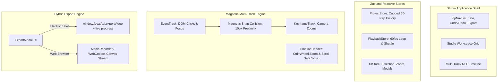

# FocalDOM Studio Deep Investigation, Flaw Analysis & Improvement Plan 🎬✨

**Document Path:** `TODO/Improve_Studio.md`  
**Parent Architecture:** [docs/README.md](../docs/README.md)  
**Audit Reference:** [TODO/AUDIT_REPORT.md](AUDIT_REPORT.md)  
**Suggested Implementation Branch:** `feat/studio-perfection`  
**Target Package:** `packages/studio` (`@focaldom/studio`)  
**Status:** 🚀 Ready for Implementation  

---

## 📌 Executive Summary

A comprehensive, line-by-line engineering audit of all source files in `packages/studio/` (`App.tsx`, timeline components, viewport canvas, inspector panels, export modal, keyboard hooks, and Zustand state stores) revealed several key usability limitations, missing magnetic timeline snapping, mock video export logic, uncapped undo history memory consumption, and canvas context recreation flashing.

This document details all investigated flaws, classifies them by severity and root cause, and provides an actionable 5-phase engineering remediation plan to elevate `packages/studio` to a **10.0 / 10.0**.

---

## 🔍 Detailed Flaw & Vulnerability Audit Matrix

### 1. Timeline & Drag Ergonomics (`src/components/timeline/`)

| ID | Severity | Category | File & Lines | Flaw / Vulnerability Description | Impact |
| :--- | :---: | :--- | :--- | :--- | :--- |
| **ST-01** | 🔴 **Major** | Missing Magnetic Snapping | `KeyframeTrack.tsx:16-59` | Dragging or resizing keyframes lacks collision detection with DOM event markers (clicks, inputs, focus). | Keyframes cannot easily snap to precise user interaction moments, causing alignment friction. |
| **ST-02** | 🟡 **Medium** | Timeline Zoom & Pan | `TimelineContainer.tsx:26-49` | Timeline zoom is only adjustable via a small slider. Missing `Ctrl + Wheel` interactive zoom and `Shift + Wheel` horizontal pan. | Suboptimal desktop NLE editing ergonomics compared to Premiere / Final Cut / CapCut. |
| **ST-03** | 🟡 **Medium** | Ruler Scrubbing Offset | `TimelineHeader.tsx:16-35` | `handlePointerDown` computes offset without compensating for `scrollLeft` of the parent container when scrolled horizontally. | Playhead jumps erratically when scrubbing a horizontally-scrolled timeline. |

---

### 2. Video Export Modal & Desktop IPC Integration (`src/components/modal/ExportModal.tsx`)

| ID | Severity | Category | File & Lines | Flaw / Vulnerability Description | Impact |
| :--- | :---: | :--- | :--- | :--- | :--- |
| **ST-04** | 🔴 **Major** | Simulated Export | `ExportModal.tsx:21-38` | `ExportModal` uses a fake `setInterval` progress timer and does not connect to `window.focalApi.exportVideo` or subscribe to `window.focalApi.onExportProgress`. | Export modal does not perform actual FFmpeg rendering when running in the Desktop Electron shell. |
| **ST-05** | 🟡 **Medium** | Missing Browser Fallback | `ExportModal.tsx:21-38` | In pure browser environments (outside Electron), no `MediaRecorder` or WebCodecs canvas recording fallback is executed. | In-browser studio users cannot export their creations. |

---

### 3. Viewport Canvas & Pixi Lifecycle (`src/components/viewport/CanvasViewport.tsx`)

| ID | Severity | Category | File & Lines | Flaw / Vulnerability Description | Impact |
| :--- | :---: | :--- | :--- | :--- | :--- |
| **ST-06** | 🟡 **Medium** | Context Rebuild Flashing | `CanvasViewport.tsx:29-55` | Changing `aspectRatio` destroys and recreates the entire `FocalPixiApp` WebGL instance rather than resizing the existing renderer. | Causes visible black canvas flashing during aspect ratio toggles. |
| **ST-07** | 🟢 **Minor** | Responsive Resize Observer | `CanvasViewport.tsx:64-70` | Canvas container does not use `ResizeObserver` to adaptively scale when inspector sidebar opens/closes. | Letterboxing does not adapt smoothly to window resizing. |

---

### 4. NLE Keyboard Shortcuts (`src/hooks/useKeyboardShortcuts.ts`)

| ID | Severity | Category | File & Lines | Flaw / Vulnerability Description | Impact |
| :--- | :---: | :--- | :--- | :--- | :--- |
| **ST-08** | 🟡 **Medium** | Missing Keyframe Split | `useKeyboardShortcuts.ts` | Missing `S` key shortcut to split selected keyframe at `currentTimeMs`. | Users cannot quickly cut/split zoom blocks without manually calculating timestamps. |
| **ST-09** | 🟢 **Minor** | Missing Shuttle Controls | `useKeyboardShortcuts.ts` | Missing `Home` / `End` (jump to start/end) and `J` / `K` / `L` standard playback shortcuts. | Power users lack fast keyboard-only scrubbing workflows. |

---

### 5. State Management & Undo Memory (`src/store/project-store.ts`)

| ID | Severity | Category | File & Lines | Flaw / Vulnerability Description | Impact |
| :--- | :---: | :--- | :--- | :--- | :--- |
| **ST-10** | 🟡 **Medium** | Uncapped Undo Stack | `project-store.ts:38-147` | History stack grows indefinitely on every slider move / drag event without a 50-step cap. | Potential memory bloat during prolonged editing sessions. |

---

## 🏗️ Target Studio NLE Architecture



---

## 🛠️ Phase-Wise Solution & Implementation Checklist

### Phase 01: Multi-Track Magnetic Snapping & Timeline Ergonomics (`src/components/timeline/`)
- [ ] **Sub-phase 01.1: Implement Magnetic Snapping Engine (`src/hooks/useMagneticSnapping.ts`)**
  - Detect proximity to DOM event timestamps ($t_{\text{event}}$) and adjacent keyframe boundaries ($t_{\text{start}}, t_{\text{end}}$):
    ```typescript
    export function findMagneticSnapPoint(
      targetMs: number,
      snapTargetsMs: number[],
      timelineZoom: number,
      thresholdPx = 10
    ): { snappedMs: number; isSnapped: boolean } {
      const thresholdMs = (thresholdPx / timelineZoom) * 1000;
      let closestDiff = Infinity;
      let closestTarget = targetMs;

      for (const target of snapTargetsMs) {
        const diff = Math.abs(target - targetMs);
        if (diff < thresholdMs && diff < closestDiff) {
          closestDiff = diff;
          closestTarget = target;
        }
      }

      return {
        snappedMs: closestDiff < thresholdMs ? closestTarget : targetMs,
        isSnapped: closestDiff < thresholdMs,
      };
    }
    ```
- [ ] **Sub-phase 01.2: Interactive Timeline Zoom & Pan**
  - Add `onWheel` listener on `.timeline-scroll-area`:
    - `e.ctrlKey`: Adjust `timelineZoom` smoothly ($30\text{px}/s \dots 600\text{px}/s$).
    - `e.shiftKey` or standard horizontal trackpad: Pan timeline horizontally.
- [ ] **Sub-phase 01.3: Scroll-Compensated Ruler Scrubbing**
  - In `TimelineHeader.tsx`, calculate `e.clientX - rect.left + scrollContainer.scrollLeft` to eliminate scrubbing offset jumps.

---

### Phase 02: Real Video Export Integration (`src/components/modal/ExportModal.tsx`)
- [ ] **Sub-phase 02.1: Native Desktop IPC Export Connection**
  - If `window.focalApi` is present, call `window.focalApi.exportVideo`:
    ```typescript
    if (window.focalApi) {
      const cleanupProgress = window.focalApi.onExportProgress((p) => {
        setProgress(Math.round(p.percent));
        setCurrentFrame(p.frame);
        setFpsThroughput(p.fps);
      });
      const result = await window.focalApi.exportVideo({
        project,
        outputPath: defaultSavePath,
        preset: selectedPreset,
        fps,
      });
      cleanupProgress();
    }
    ```
- [ ] **Sub-phase 02.2: In-Browser Client-Side Export Fallback**
  - Use `canvas.captureStream(fps)` and `MediaRecorder` in browser environments with zero desktop dependencies.

---

### Phase 03: Viewport Lifecycle & Dynamic Resizing (`src/components/viewport/CanvasViewport.tsx`)
- [ ] **Sub-phase 03.1: Dynamic Viewport Resize Method**
  - Add `app.resize(width, height)` method to `FocalPixiApp` to adjust canvas dimensions without destroying the WebGL context.
- [ ] **Sub-phase 03.2: ResizeObserver for Retina Scaling**
  - Attach `ResizeObserver` on `.canvas-viewport-container` to guarantee pixel-perfect scaling on window resizes.

---

### Phase 04: NLE Power Shortcuts & Split Editing (`src/hooks/useKeyboardShortcuts.ts`)
- [ ] **Sub-phase 04.1: Keyframe Split Action (`S` Key)**
  - Implement `splitKeyframe(selectedKeyframeId, currentTimeMs)` splitting a keyframe into two contiguous segments.
- [ ] **Sub-phase 04.2: Shuttle & Navigation Shortcuts**
  - `Home`: Seek to `0ms`.
  - `End`: Seek to `durationMs`.
  - `J` / `K` / `L`: Reverse 2x / Pause / Forward 2x.

---

### Phase 05: State Hardening & Memory Guarding (`src/store/project-store.ts`)
- [ ] **Sub-phase 05.1: Capped 50-Step Undo/Redo Stack**
  - Limit `history` array to maximum 50 states (`history.slice(-50)`).
- [ ] **Sub-phase 05.2: Structured Cloning for Keyframes & Events**
  - Ensure deep immutability when capturing history snapshots.

---

## ✅ Acceptance Criteria & Quality Checklist

1. **Magnetic Snapping:** Keyframes snap to exact DOM click/input timestamps with visual feedback when dragged within $10\text{px}$.
2. **Smooth Ergonomic Zoom:** `Ctrl + Wheel` zooms the timeline smoothly centered on the cursor.
3. **Live Desktop 4K Export:** `ExportModal` streams live frame progress from native FFmpeg over IPC.
4. **NLE Split Tool:** Pressing `S` cleanly splits the active keyframe at the playhead position.
5. **Bounded Memory Footprint:** History stack remains capped at 50 steps without memory leaks.
