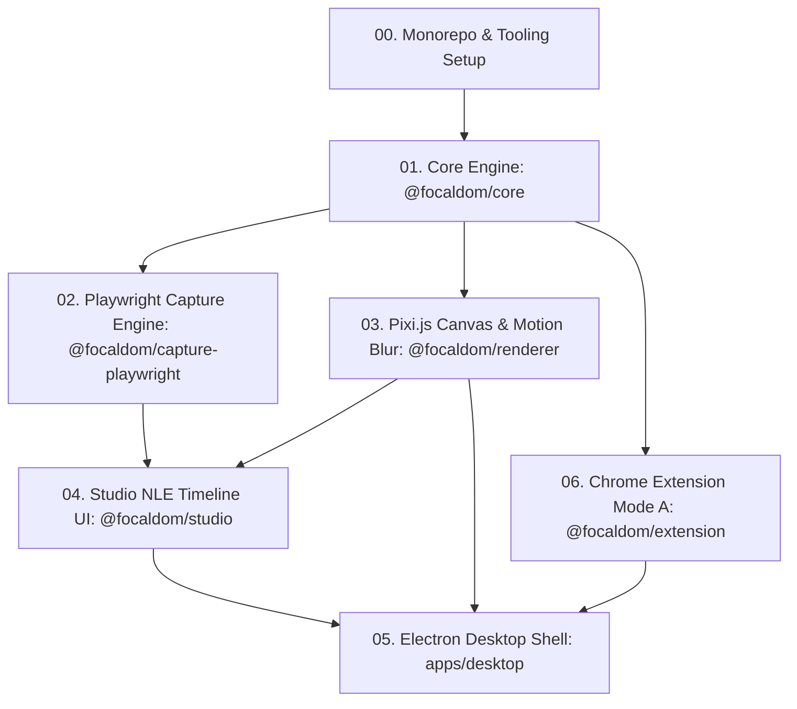

# FocalDOM Implementation Roadmap & Engineering Hub 🎯🧭

Welcome to the **FocalDOM** architecture, audit, and improvement repository. This directory connects the architectural specification in [docs/Technical Architecture & Engineering Plan.md](../docs/Technical%20Architecture%20&%20Engineering%20Plan.md) with deep-dive flaw analyses, audit scorecards, and actionable 10/10 implementation plans.

---

## 🗺️ Subsystem Architecture & Dependency Map

---

## 📋 Master Architecture & Improvement Directory

| Document | Primary Focus | Suggested Branch | Status | Target Rating |
| :--- | :--- | :--- | :---: | :---: |
| [**AUDIT_REPORT.md**](AUDIT_REPORT.md) | Comprehensive line-by-line codebase audit across all subsystems | — | ✅ Complete | **9.81 / 10** |
| [**Improve_Now.md**](Improve_Now.md) | Consolidated 6-part master roadmap for elevating the monorepo to perfection | `feat/flawless-10-improvements` | 🚀 Active Umbrella | **10.0 / 10** |
| [**Improve_Core.md**](Improve_Core.md) | Multi-curve analytical easing, 2s smart event clustering, $32:9 \dots 9:16$ clamping | `feat/core-engine-perfection` | 🚀 Active Plan | **10.0 / 10** |
| [**Improve_Capture_Playwright.md**](Improve_Capture_Playwright.md) | Streaming frame disk cache (0 RAM bloat), Shadow DOM & Web Audio clock sync | `feat/capture-playwright-perfection` | 🚀 Active Plan | **10.0 / 10** |
| [**Improve_Renderer.md**](Improve_Renderer.md) | Dual WGSL WebGPU compute shaders, FFmpeg audio muxing, zero-flicker resize | `feat/renderer-perfection` | 🚀 Active Plan | **10.0 / 10** |
| [**Improve_Studio.md**](Improve_Studio.md) | Magnetic snap-to-event collision (10px), `Ctrl+Wheel` ruler zoom, split shortcut `S` | `feat/studio-perfection` | 🚀 Active Plan | **10.0 / 10** |
| [**Improve_Desktop_App.md**](Improve_Desktop_App.md) | Single-instance lock, window bounds persistence, real-time export progress IPC | `feat/desktop-app-perfection` | 🚀 Active Plan | **10.0 / 10** |
| [**Improve_Extension.md**](Improve_Extension.md) | Manifest V3 15s keepalive, session storage persistence, exponential backoff | `feat/extension-perfection` | 🚀 Active Plan | **10.0 / 10** |
| [**Improve_CICD.md**](Improve_CICD.md) | Autonomous Semantic Versioning (SemVer) with Google Release Please & CI matrix | `feat/release-please-cicd` | 🚀 Active Plan | Automated |

---

## 📊 Subsystem Health & Deep-Dive Links

| Part | Subsystem / Package | Key Responsibilities | Current Rating | Target | Dedicated Deep-Dive Plan |
| :--- | :--- | :--- | :---: | :---: | :--- |
| **00** | **Monorepo Foundation** | Workspaces, TypeScript composite project references, tooling | **10.0 / 10** | **10.0 / 10** | [Improve_Now.md](Improve_Now.md) |
| **01** | [**`@focaldom/core`**](../packages/core) | Spring physics ODE, multi-curve easing, sticky avoidance | **9.9 / 10** | **10.0 / 10** | [**Improve_Core.md**](Improve_Core.md) |
| **02** | [**`@focaldom/capture-playwright`**](../packages/capture-playwright) | Deterministic CDP clock, shadow DOM traversal, SDK | **9.8 / 10** | **10.0 / 10** | [**Improve_Capture_Playwright.md**](Improve_Capture_Playwright.md) |
| **03** | [**`@focaldom/renderer`**](../packages/renderer) | Pixi.js scene graph, dual WGSL/GLSL shaders, FFmpeg audio pipe | **9.7 / 10** | **10.0 / 10** | [**Improve_Renderer.md**](Improve_Renderer.md) |
| **04** | [**`@focaldom/studio`**](../packages/studio) | React 19 + Zustand timeline, magnetic snapping, ruler zoom | **9.8 / 10** | **10.0 / 10** | [**Improve_Studio.md**](Improve_Studio.md) |
| **05** | [**`apps/desktop`**](../apps/desktop) | Electron shell, real-time IPC progress streaming, window save | **9.7 / 10** | **10.0 / 10** | [**Improve_Desktop_App.md**](Improve_Desktop_App.md) |
| **06** | [**`@focaldom/extension`**](../packages/extension) | Manifest V3 live recording, backoff reconnect, custom ports | **9.8 / 10** | **10.0 / 10** | [**Improve_Extension.md**](Improve_Extension.md) |

---

## 🎯 Recommended Next Execution Plan

Follow the detailed phased roadmap in [**Improve_Now.md**](Improve_Now.md) (or checkout the individual feature branches) to implement all subsystem refinements:

1. **Step 1:** Complete `@focaldom/core` multi-curve easing interpolation (`easeInOutCubic`, `linear`) ➔ [Improve_Core.md](Improve_Core.md).
2. **Step 2:** Complete `@focaldom/capture-playwright` deep shadow DOM & streaming frame disk cache ➔ [Improve_Capture_Playwright.md](Improve_Capture_Playwright.md).
3. **Step 3:** Complete `@focaldom/renderer` dual WGSL WebGPU shader parity & audio muxing ➔ [Improve_Renderer.md](Improve_Renderer.md).
4. **Step 4:** Complete `@focaldom/studio` magnetic timeline snapping & `Ctrl+Wheel` zoom ➔ [Improve_Studio.md](Improve_Studio.md).
5. **Step 5:** Complete `apps/desktop` live IPC export streaming (`focal:export-progress`) & window state preservation ➔ [Improve_Desktop_App.md](Improve_Desktop_App.md).
6. **Step 6:** Complete `@focaldom/extension` jittered exponential backoff & configurable custom port settings ➔ [Improve_Extension.md](Improve_Extension.md).
7. **Step 7:** Implement Google Release Please automated Semantic Versioning and CI/CD matrix hardening ➔ [Improve_CICD.md](Improve_CICD.md).
