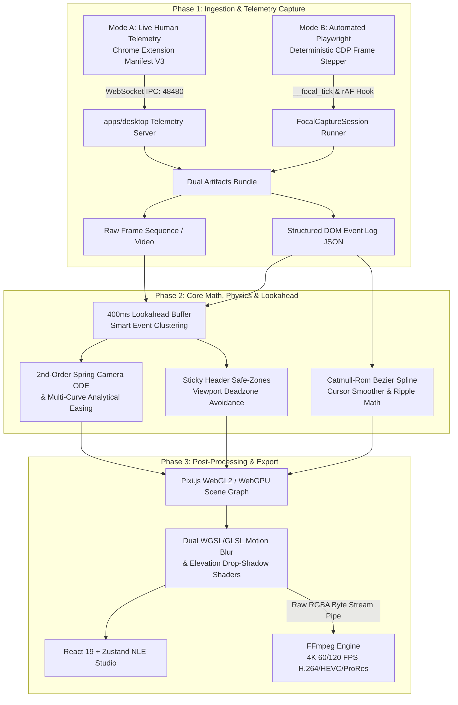
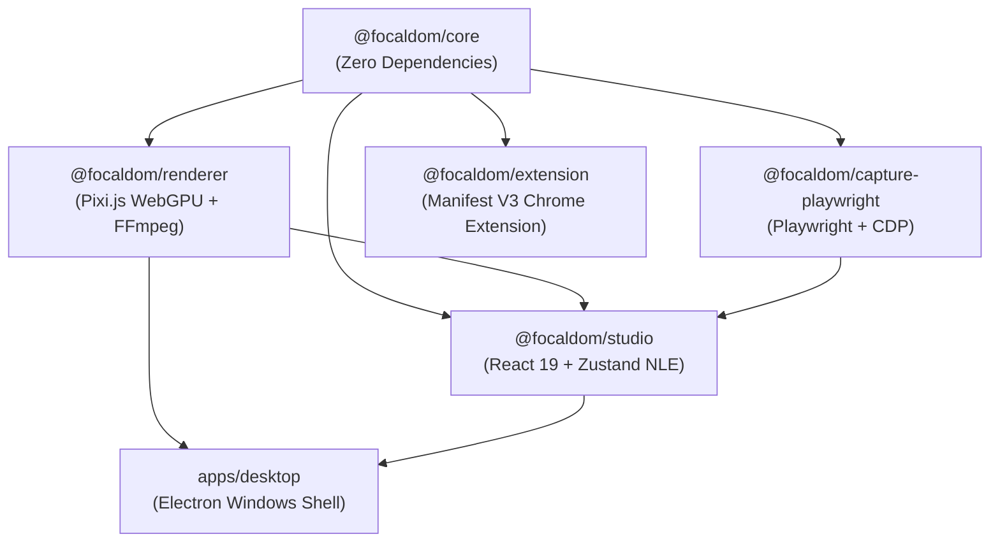

# System Architecture Overview

**FocalDOM** bridges deterministic browser automation (Mode B: Playwright CDP) and live telemetry recording (Mode A: Chrome Extension) with a hardware-accelerated post-processing virtual camera engine.

---

## 🏗️ Multi-Phase Pipeline Architecture

---

## 📦 Monorepo Package Topology

FocalDOM is architected as an immutable, strictly-typed monorepo managed via **PNPM Workspaces**:

### Subsystem Boundaries & Responsibilities

| Package / App | Core Responsibilities | Technology Stack |
| :--- | :--- | :--- |
| [`@focaldom/core`](../../packages/core) | Pure mathematical formulas, 2nd-order ODE spring camera, cubic Bezier cursor smoothing, sticky avoidance heuristics, and canonical project schemas. | Vanilla TypeScript (Zero external dependencies) |
| [`@focaldom/capture-playwright`](../../packages/capture-playwright) | Deterministic CDP screencast collector, in-page DOM metadata tracker, virtual clock injector, and scenario CLI runner. | Playwright, Chromium CDP, CAC |
| [`@focaldom/renderer`](../../packages/renderer) | Pixi.js scene graph compositing, dual WebGPU WGSL / WebGL2 GLSL 4-pass temporal motion blur shaders, and raw RGBA FFmpeg streaming pipes. | Pixi.js v8, WebGPU, WebGL2, FFmpeg |
| [`@focaldom/studio`](../../packages/studio) | Multi-track NLE timeline UI, magnetic snap-to-event collision detection, real-time physics tuner, styling inspector, and export modal. | React 19, Zustand, Lucide Icons, Vite |
| [`@focaldom/extension`](../../packages/extension) | Manifest V3 Chrome Extension streaming live DOM bounding boxes and pointer telemetry over WebSocket. | Chrome Extensions MV3, WebSockets |
| [`apps/desktop`](../../apps/desktop) | Electron desktop shell for Windows, WebSocket telemetry server, `.focal` ZIP project manager, and native FFmpeg process controller. | Electron, Node.js, Archiver, Adm-Zip |

---

## 🔄 Dual Ingestion Modes

### Mode A: Live Human Telemetry Recording
- The user browses naturally on any live website with the **FocalDOM Chrome Extension** active.
- As the user clicks, types, hovers, and scrolls, the injected content script serializes DOM element coordinates, computed z-indices, and sticky header bounds.
- Telemetry is streamed over local WebSocket (`ws://127.0.0.1:48480`) to the **Electron Desktop App**, creating an editable project in the Studio.

### Mode B: Automated Playwright Deterministic Capture
- Automated test scripts or declarative `scenario.yaml` files drive a headless Chromium instance.
- The **Virtual Clock** overrides `requestAnimationFrame` and `performance.now()`, locking browser time strictly to sequential frame indices.
- Captures pixel-perfect, 60/120 FPS videos with zero dropped frames even on complex, computationally heavy web applications.
