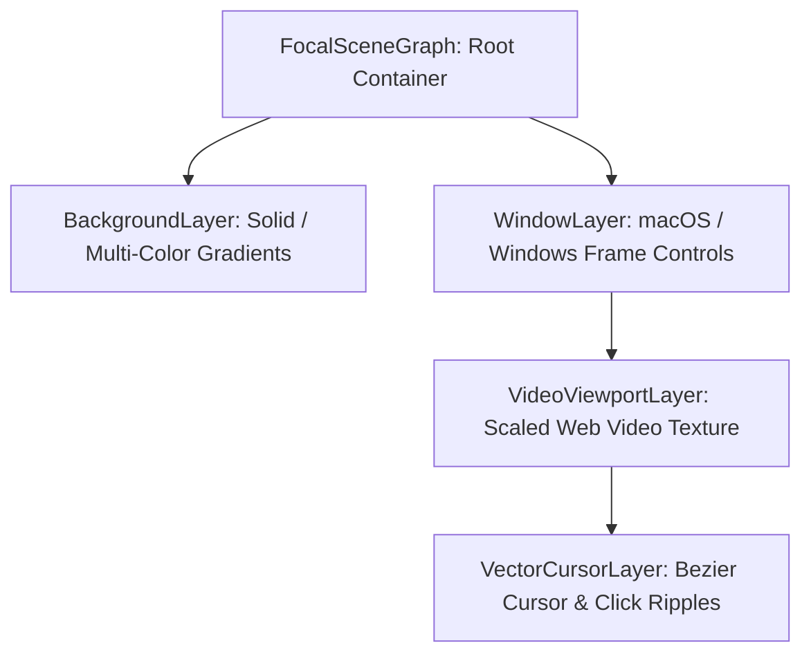

# WebGPU Rendering Engine & FFmpeg Pipeline

This document details the hardware-accelerated 2D scene graph, multi-pass temporal motion blur shaders, and raw RGBA byte-streaming architecture implemented in `@focaldom/renderer`.

---

## 1. Pixi.js Scene Graph Hierarchy

The rendering engine organizes visual elements into an explicit layer hierarchy:



### Layer Responsibilities

1. **`BackgroundLayer`**: Renders custom linear/radial gradients or solid backdrop colors behind the recorded window.
2. **`WindowLayer`**: Draws rounded window chrome corners (`borderRadius`), drop-shadow filters, and OS traffic light controls.
3. **`VideoViewportLayer`**: Applies the dynamic `SpringCamera` 2D affine transform matrix ($x, y, \text{scale}$) to the video frame texture with a rounded clipping mask.
4. **`VectorCursorLayer`**: Renders the reconstructed $C^1$-smooth SVG vector cursor and animated shockwave click ripple pulses.

---

## 2. Dual WGSL / GLSL Temporal Motion Blur Shader

To simulate realistic optical motion blur during rapid camera pans and zooms, the `MotionBlurFilter` samples sub-frame velocity vectors across 4 temporal accumulation taps:

### WGSL (WebGPU Compute Pipeline)
```wgsl
@fragment
fn mainFragment(@location(0) uv: vec2<f32>) -> @location(0) vec4<f32> {
  let vel = uniforms.uVelocity * uniforms.uIntensity;
  var color = textureSample(uTexture, uSampler, uv);
  color += textureSample(uTexture, uSampler, uv - vel * 0.25);
  color += textureSample(uTexture, uSampler, uv - vel * 0.50);
  color += textureSample(uTexture, uSampler, uv - vel * 0.75);
  color += textureSample(uTexture, uSampler, uv - vel * 1.00);
  return color / 5.0;
}
```

---

## 3. High-Throughput Raw RGBA FFmpeg Streamer

Traditional screen recording pipelines encode frames to disk as PNG files before invoking FFmpeg, creating severe disk I/O and CPU bottlenecks.

FocalDOM pipes uncompressed 32-bit raw RGBA pixel arrays directly to FFmpeg `stdin`:

```
┌─────────────────────────┐                     ┌─────────────────────────┐
│ Pixi.js Canvas Engine   │                     │ FFmpeg Process (stdin)  │
│ gl.readPixels / extract ├──[ Raw RGBA Pipe ]─►│ -f rawvideo             │
│ (3840 x 2160 @ 60 FPS)  │                     │ -pix_fmt rgba           │
└─────────────────────────┘                     │ -c:v libx264 -crf 18    │
                                                └───────────┬─────────────┘
                                                            ▼
                                                ┌─────────────────────────┐
                                                │ 4K Master Video (.mp4)  │
                                                └─────────────────────────┘
```

### Performance Advantages:
- **Zero Disk Intermediaries:** Eliminates saving tens of thousands of PNG files to disk.
- **Constant Memory Footprint:** Frames are streamed and garbage-collected sequentially.
- **$\ge 60\text{ FPS}$ Encoding Throughput:** Reaches real-time encoding speeds on modern multi-core CPUs.
